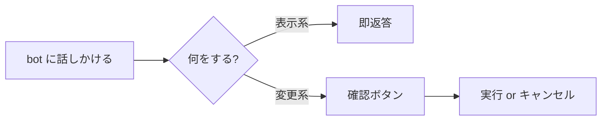

## はじめに — MeX Next を Discord で使い始める

> **対象読者**: 新しく MeX Next を導入する顧客 (アカウントの持ち主)
> **前提**: 運営 (operator) から「セットアップ完了しました」の連絡を受け取っている
> **読了時間**: 約 10 分

MeX Next は X (Twitter) アカウントを 1 日中まわす運用 OS です。あなたが触るのは **Discord 1 つだけ**。投稿の生成、品質チェック、予約、振り返り、リプ判断はすべて Discord 上のチャットで完結します。

このページは初回オンボードを 1 回だけたどるためのガイドです。明日以降の流れは [02-daily-rhythm.md](./02-daily-rhythm.md) を参照してください。

## 1. 運営からもらうもの

運営があなたのために用意するのは次の 3 つです。

| もの | 何のために |
| --- | --- |
| Discord サーバーへの招待リンク | あなたと bot だけが入る専用サーバー |
| あなた専用 channel | bot からの通知が届く場所 |
| MeX bot の表示名 (例: `@mex-tanaka`) | DM やメンション宛先 |

> 受け取っていない情報があれば、運営に「Discord の招待がまだ届いていません」と一言ください。あなた側で Doppler / X Developer Portal / VPS の設定をする必要はありません。

## 2. 初回ログイン

1. もらった招待リンクから Discord サーバーに入る
2. 自分専用 channel に bot から自動で歓迎メッセージが届くことを確認

```text
こんにちは。MeX bot です。
朝 7:00 JST に「今日の投稿案」を 1 件、この channel にお届けします。
何か変えたい時は私に DM か @mention で話しかけてください。
```

3. 試しに DM で `状態確認` と送ってみる。bot が現在の cadence / 予約数 / 自動運用フラグを返してくれます。

## 3. 一番大事な 3 つの動作

これだけ覚えれば運用に入れます。



1. **bot に DM するか、自分の channel で `@mex-...` メンションする**
2. **自然文で書く** ─ 「予約見せて」「今日いらない」「もう少し柔らかく」
3. **確認ボタンが出たら必要な方を押す** ─ 取り消しや今すぐ投稿は必ず確認が出る

slash command (`/mex post` 等) も使えますが、覚える必要はありません。話しかける方が早いです。

## 4. 自動化レベルの選択

最初は **semi_auto** で始めます。投稿案、引用、リプライ候補は bot が作り、あなたが Discord で確認してから進めるモードです。慣れてきて「この判断なら任せて大丈夫」と思えたら **full_auto** に上げられます。慎重に止めたい時は **manual** に戻せます。

```text
自動化レベルを full_auto にして
自動化レベルを semi_auto に戻して
```

迷ったら semi_auto のままで大丈夫です。

## 5. bot との会話

bot はあなたの言葉をそのまま拾って確認します。「全部取り消して」と言えば「全部 = 過去分も含めた残りの予約」と解釈した上で、「過去 5 件 + 今日 1 件 = 計 6 件を取り消します。実行しますか?」のように件数を出します。そこで `はい` と返すと実行、`いいえ` と返すとキャンセルです。曖昧な時は bot から聞き返します。

## 6. 声 (voice) の登録

bot がすでにあなたの声で文章を作るには、運営が事前に「サンプル投稿」を 5〜10 本食わせています。最初の draft が「これは自分の口調っぽいかも」と思えれば成功です。

ズレを感じたら、その場で自然文で修正指示します。

```text
あなた: もっとぼくっぽい話し言葉で。「〜なんだよね」みたいに
bot:    📝 修正版を作りました (rev 2)
        「ぼくが副業を続けられたのは、稼ぎより…」
        [予約] [もう一度修正] [見送り]
```

修正は次回以降の draft 生成にも反映されます (edit-diff 学習)。

## 7. cadence (投稿頻度) の確認

初期値は **light** = 1 日 1 本、朝 06:00-09:00 JST のみ。控えめに始めて、慣れてから上げるのを推奨しています。

| profile | 1 日の投稿本数 | 時間帯 |
| --- | --- | --- |
| light | 1 本 | 朝 06-09 |
| standard | 2-3 本 | 朝 / 昼 / 夜 |
| aggressive | 4 本以上 | hot zones を広く活用 |

切り替え方は [04-cadence-and-skip.md](./04-cadence-and-skip.md) を参照。

## 8. やってはいけないこと

- VPS に SSH しない
- GitHub の `<account>-x-ops` repo を直接編集しない
- `account.json` / `state.json` を手で書き換えない
- bot を別 server に勝手に追加しない

これらは bot の管理範囲です。直接いじると履歴と整合が崩れ、運営側の修復作業が必要になります。

## 9. 次に読むもの

- [01-talk-to-bot.md](./01-talk-to-bot.md) — 自然文の例文 20 個
- [02-daily-rhythm.md](./02-daily-rhythm.md) — 1 日の流れ
- [06-troubleshooting.md](./06-troubleshooting.md) — bot が反応しない時
