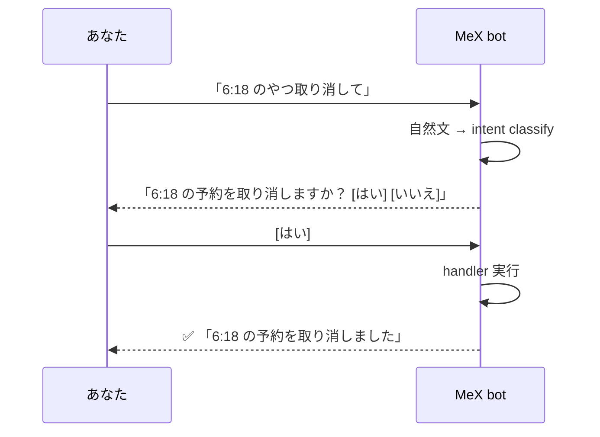

## bot に話しかけて操作する

> **対象読者**: MeX Next の顧客 (操作する人)
> **前提**: [00-getting-started.md](./00-getting-started.md) が終わっている
> **読了時間**: 約 8 分

slash command (`/mex post` など) を覚える必要はありません。**DM で話しかける** か、自分の channel で `@mex-...` のように **メンション** すれば、自然な日本語で操作できます。

> slash command は power user / operator 用に並行で残しています。話しかける方が早いと感じればそれで OK。

## 1. よく使う言い回し 20 例

| やりたいこと | 例文 |
| --- | --- |
| 今日の予約を見る | 「予約見せて」「今日の予約一覧」 |
| 特定時刻の予約を取り消す | 「6:18 のやつ取り消して」「18:18 の予約キャンセル」 |
| 今日の予約を全部止める | 「今日いらない」「今日は投稿しない」 |
| 1 本だけ今すぐ投稿する | 「6:18 のやつ今すぐ投稿して」 |
| 新しい投稿案を作る | 「新しい投稿作って」「AI の活用について書いて」 |
| topic を伝える | 「副業の続け方の話書いて」 |
| ターゲットを追加する | 「@tanaka_san を追加して」「tanaka_san 追跡して」 |
| ターゲットの一覧 | 「ターゲット見せて」「追跡対象一覧」 |
| ターゲットを外す | 「@tanaka_san を外して」 |
| 状態確認 | 「今の状態確認」「MeX の調子は？」 |
| 自動運用の状態を見る | 「自動運用どう？」「automation status」 |
| 自動運用を一括 ON | 「自動運用を全部 ON にして」 |
| ペースを軽くする | 「投稿ペース軽めにして」 |
| ペースを普通にする | 「ペース普通に戻して」 |
| ペースを強める | 「ペース強めにして」 |
| 使い方を見る | 「使い方教えて」「help」 |
| 修正指示 (thread 内) | 「もっと柔らかく」「最後に問いかけ 1 行足して」 |
| 別案を作る (thread 内) | 「もう 1 個別パターン作って」 |
| 見送る (thread 内) | 「今回は見送り」「これは出さない」 |
| 修正キャンセル | 「やっぱり元のままで」 |

## 2. 確認ボタンが出る場合

取り消し / 今すぐ投稿 / 自動運用切替 など「あと戻りしにくい操作」は、必ず **[はい] [いいえ]** が一度出ます。

```text
あなた: 今日いらない
bot:    今日の予約をすべて取り消しますか？
        [はい] [いいえ]
```

- `[はい]` を押すまで何も実行されません
- `[いいえ]` を押すと「キャンセルしました」で閉じます
- 表示系 (一覧 / 状態確認) は確認なしで即返答

> 仕組み的には intent-router の destructive whitelist が効いています。LLM が誤って「確認不要」と判断しても無視され、確認ボタンが必ず出ます。詳しくは [developer/11-intent-router.md](../developer/11-intent-router.md) を参照。

## 3. 確認の典型フロー (Mermaid)



## 4. 進行中の表示

時間がかかる処理 (新しい投稿生成など) では bot が進行を 1 通の card で見せます。

```text
⏳ 投稿案を生成しています...
   (5-axis 品質チェック中)

✅ 📝 投稿案ができました
   topic: 副業を続けるための「定点」
   「ぼくは数字を毎週同じ時間に見るようにしてる…」
   [予約] [今すぐ投稿] [修正] [別案] [見送り]
```

別メッセージで埋まる形ではなく、**1 通の card が更新される** ので Discord が荒れません。

## 5. うまく聞き取れなかった時

bot が意図を取りきれない場合は次のように返ります。

```text
うまく聞き取れませんでした。
「予約見せて」「6:18 のやつ取り消して」「今日は投稿いらない」のように書くか、
詳しい操作は `/mex help` でも見られます。
```

このときの対応:

- 言い回しを少し具体化する (時刻を入れる、ターゲット名を入れる)
- それでも不安なら `/mex help` で操作一覧

## 6. bot が反応する条件

bot は次のときだけ自然文を解釈します。

- DM チャンネル (直接メッセージ)
- 任意のチャンネルで `@mex-...` メンション

`/` で始まるメッセージは slash command として処理されるので、自然言語ルートは通りません。
進行中の onboarding / 投稿案編集 / ターゲット設定 thread の返答は、それぞれ専用フロー側で処理されます。

## 7. キャンセルしたい時

LLM が遅い / 結果がいらなくなった場合、`@bot キャンセル` で進行中の turn を止められます (turn-cancellation)。完了済みの予約は対象外で、未完了の生成や検討中の処理だけが止まります。

## 8. 補助コマンド (任意)

slash command も引き続き使えます。詳しくは `/mex help`。

| slash | 同じ自然文 |
| --- | --- |
| `/mex post` | 「投稿作って」 |
| `/mex schedule list` | 「予約見せて」 |
| `/mex schedule cancel` | 「全部取り消して」 |
| `/mex targets list` | 「ターゲット見せて」 |
| `/mex automation status` | 「自動運用どう？」 |
