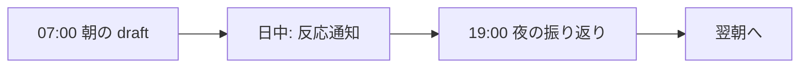

## 1 日のリズム — 朝の draft / 反応通知 / 夜の振り返り

> **対象読者**: 日常運用に入った顧客
> **前提**: [00-getting-started.md](./00-getting-started.md), [01-talk-to-bot.md](./01-talk-to-bot.md) を読んだ
> **読了時間**: 約 7 分

MeX Next の 1 日は 3 つの接点で回ります。



時間帯ごとの目安:

```mermaid
gantt
    dateFormat HH:mm
    axisFormat %H:%M
    title 顧客 1 日の流れ (JST)
    section 朝
    morning digest    :a1, 07:00, 5m
    daily draft       :a2, 07:05, 5m
    顧客承認 (任意)   :a3, 07:30, 30m
    section 昼
    publish (auto)    :b1, 08:30, 1m
    reactions poll    :b2, after b1, 30m
    section 夕
    target activity   :c1, 17:00, 60m
    daily retro       :c2, 19:00, 30m
    section 夜
    放置 OK           :d1, 22:00, 60m
```



毎日 5〜10 分で回せるのが目標です。

## 1. 朝 07:00 JST — 今日の draft

`mex-daily-<account>.timer` が起動して、その日の投稿案 1 本があなたの channel に届きます (cadence=light の場合)。

```text
🟡 今日の draft (Posting v2)
  topic: 副業を続けるための「定点」
  candidate: 「ぼくは数字を毎週同じ時間に見るようにしてる…」
  状態: 確認待ち

[この内容で予約] [今すぐ投稿] [修正を指示する] [別案を作る] [今回は見送る]
```

state emoji の意味:

- 🟡 準備中 (もう少し待つ)
- 🔵 進行中 (内容を確認中)
- 🟠 あなたの判断待ち (button を押す)
- 🟢 完了
- 🔴 エラー

button を押せばその場で進みます。文面を直したい時は thread 内に自然文で書きます。

```text
あなた:
もっと柔らかくして。最後に問いかけを 1 行だけ足して

bot:
📝 投稿案 (rev 2)
「ぼくは副業を『稼ぎ』というより、会社の外でも自分で立てる感覚を持つために始めたんよね。
今の仕事、肩書きがなくなっても残りますか?」

[予約] [今すぐ投稿] [修正] [別案]
```

draft card は **1 通の card を編集して進行を見せる** 形なので、新しいメッセージで埋まりません。

> 5-axis 品質判定 (stop_power / specificity / progression / voice_match / length_fit) はすべて bot 内部で済んでおり、3 軸以上 pass しなければ自動 repair が走ってからあなたに届きます。詳細: [developer/20-posting-state-machine.md](../developer/20-posting-state-machine.md)

## 2. 予約

`[この内容で予約]` を押すと、bot が `hot_zones` (投稿に向く時間帯) の中から時刻を 1 つ選んで予約します。毎回ぴったり同じ時刻ではなく、その時間帯の中で random offset (±30 分) で分散します。

```text
✅ 04-21 12:18 に投稿予約しました
```

時刻の細かい手動調整は不要です。

- あなたは「何を出すか」を決める
- MeX は「いつ出すか」を hot_zones 内で自動分散する

## 3. 日中 — 反応通知

X API poll (30min 間隔) でリプ / 引用 / リツイートが収集されます。緊急度が高いものだけ個別 thread で届きます。

```text
📣 過去 24h 反響 summary
  reply 受信: 8 件 (うち応答済 5 / pending 3)
  quote 受信: 2 件 (うち応答済 1 / pending 1 / skip 0)
  retweet 受信: 14 件 (集計のみ、Top 3: @user1 / @user2 / @user3)
```

| thread prefix | 意味                    |
| ------------- | ----------------------- |
| `[RPLY @who]` | リプ判断会議            |
| `[QREV]`      | 引用された時の応答会議  |
| `[POST]`      | 投稿 1 本を決める会議   |
| `[WREV]`      | 週次振り返り (自動配信) |
| `[ALERT]`     | 異常通知                |

判断方法は [03-handle-replies.md](./03-handle-replies.md) を参照。

## 4. 夜 19:00 JST — 振り返り (daily horizon)

その日の投稿と反応をまとめた retrospective が届きます。

```text
🗒️ 今日の振り返り
  投稿: 1 本 (12:18 publish)
  reply: 3 件 (応答済 2 / 1 件は明日に持ち越し)
  気づき: 「定点を持つ」hook は反応が良い (engagement +30%)

[適用] [スキップ]
```

- daily は writeback 対象が無いので「読んで終わり」で OK
- 24h 放置で自動確定

## 5. 週次 / 月次 / 四半期 / 半期

horizon ごとに別タイミングで届きます。

| horizon   | 頻度       | writeback          |
| --------- | ---------- | ------------------ |
| daily     | 毎日 19:00 | (なし)             |
| weekly    | 月曜 09:00 | (なし)             |
| monthly   | 月初 09:00 | active_window      |
| quarterly | 四半期初   | goal_stack / brand |
| half      | 半期初     | half_focus         |

writeback がある horizon では「適用 / ロールバック」のボタンが出ます。

```text
[QREV q2] 四半期 retrospective

提案された方向性:
- 副業実践者向けの語り口を強化
- 失敗談の比率を 20 → 30% に
- 「肩書きの外側」テーマを継続

[適用] [一部だけ適用] [ロールバック] [スキップ]
```

`[適用]` を押せば account.json に書き戻されます。確定までしなくても 24h で自動確定します。

onboarding が終わると、四半期 → 月次 → 週次の方針確認が自動で続きます。週次は毎週月曜 09:00 JST、月次は月初 09:00 JST に始まります。途中の質問が残っている場合は、数日後に「続きやりますか?」という確認が来ます。

週初 / 月初には、前回の方針を見て「維持」「変更する」を選ぶ軽い確認も届きます。追跡対象が 1 週間動いていない時は「この人を外しますか?」の見直し、未回答の方針確認が残っている時は再開の声かけがあります。

## 6. ニュースとトレンド

`今日のニュース` / `トレンド` と送ると、今日参考にしているニュースと X のトレンドを見られます。投稿案を作る時も、関係がある話題だけ自然に混ぜます。

```text
あなた: 今日のニュース見せて
bot:    今日参考にしているニュースと X トレンドをまとめます...
```

特定の RSS や業界メディアを足したい時は、運営に「news_sources にこの RSS を追加して」と依頼してください。

## 7. ピーク時の運用負荷

| 区分                    | 1 日               |
| ----------------------- | ------------------ |
| 朝 (draft 確認)         | 1〜3 分            |
| 日中 (反応通知 1〜2 件) | 2〜5 分            |
| 夜 (振り返り)           | 0〜2 分 (放置可)   |
| 月次 review             | 月 1 回、10〜15 分 |

合計 5〜10 分/日 が目安です。

## 8. 「今日いらない」と言いたい時

体調不良 / 出張 / 気分が乗らない日は `今日いらない` と DM。今日の予約 (もうあれば) と今日の draft 通知をすべて止められます。詳しくは [04-cadence-and-skip.md](./04-cadence-and-skip.md) 参照。
