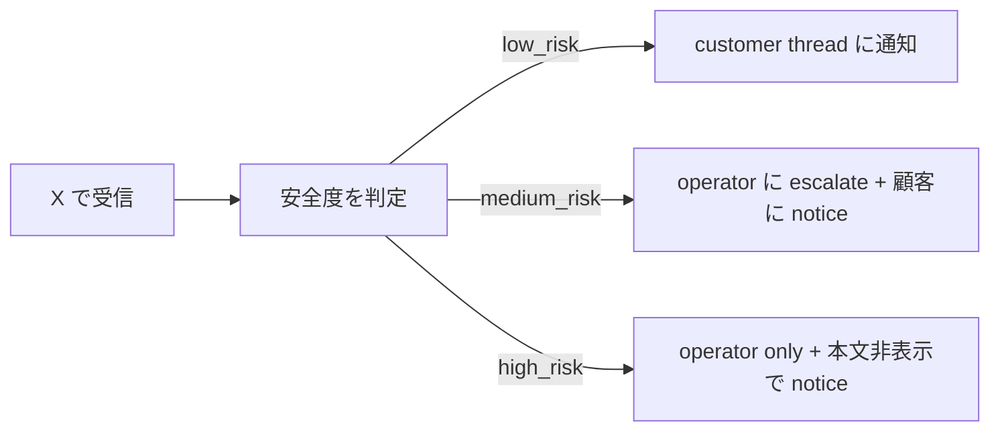

## リプ / 引用が来た時の判断

> **対象読者**: 反応が来始めた顧客
> **前提**: 朝の draft フローを 1 週間以上回した
> **読了時間**: 約 6 分

MeX Next は X API を 30 分ごとに確認して、あなたへの reply / quote / mention / 影響の大きい retweet を回収します。**全部にあなたが目を通す必要はありません**。bot が安全度を 3 段階に振り分け、応答の下書きまで用意します。

## 1. risk 分類



| risk | 例 | あなたが見るもの |
| --- | --- | --- |
| low_risk | 賞賛 / 同意 / 軽い質問 | thread (本文 + 下書き reply 表示) |
| medium_risk | 反論 / クレーム気味 / 個人情報を含む | summary (operator に escalate 済) |
| high_risk | 攻撃 / 法的リスク / なりすまし疑い | 件数だけ (本文非表示) |

medium / high は operator が一次対応します。あなたが見るのは主に low です。

## 2. low_risk thread の見え方

```text
[RPLY @tanaka_san]
元投稿: 「副業を続けるための『定点』...」
相手: @tanaka_san
本文: 「自分も毎週日曜に振り返る習慣を作ったら続いた。共感です」

📝 下書き reply:
「ありがとうございます。日曜の朝って、
週の流れを切り替えるタイミングとして良いですよね」

[この内容で返信] [修正] [別案] [スキップ]
```

button or 自然文で進みます。

## 3. 自然文での反応

```text
あなた: もっとカジュアルに
bot:    📝 reply (rev 2)
        「あー分かる、日曜朝って…」
        [この内容で返信] [修正] [別案] [スキップ]

あなた: 下のやつでお願い
bot:    ✅ 返信を送りました (12:34 publish)
```

「下のやつ」「上のやつ」「最初のやつ」のような指示語も、直前の会話を見て bot が解釈します。

## 4. 引用された時 ([QREV])

あなたの投稿が引用された時、別 thread で見せます。元投稿 / 引用元の本文 / quote 主の発言 / 下書き response がまとまります。

```text
[QREV @yamada-san]
元投稿: 「副業を続けるための『定点』...」
引用主: @yamada-san
引用本文: 「これ、まさに自分の課題です。続け方が分からない」

📝 下書き response:
「@yamada-san さん、続け方の最初の壁、自分も同じでした…」

[この内容で投稿] [修正] [スキップ]
```

quote response は「相手の引用文を受けて 1 本のポストを作る」位置付けなので、reply より少し丁寧な文体で生成されます。

## 5. retweet

通常の retweet は summary だけです。本数の多い RT 主 (top 3) も朝の summary に集計されます。

影響の大きい RT 主 (フォロワー数 / engagement 大) は個別通知が来ます。

```text
🔁 影響度の高い retweet
  @big_account (12,000 followers) があなたの 12:18 ポストを RT

(対応は不要、参考情報)
```

## 6. スキップ判断の基準

無理に全部応答する必要はありません。次のときは `[スキップ]` で OK。

- 内容に同意できない
- 流れがズレる
- 体力が無い
- すでに応答済みの相手

スキップは `state.json` に記録されるので、同じ相手から再度反応が来ても重複表示されません。

## 7. medium_risk の通知

medium 以上は operator に escalate されます。あなたへの通知は次のような形です。

```text
⚠️ ご注意
  反論気味の reply が 1 件届きました。
  運営側で確認しています。あなたが対応する必要はありません。
  (緊急時のみ運営から連絡します)
```

## 8. 困った時

`@bot help reply` で reply 関連のガイドが出ます。あるいは個別 thread の中で「これどう思う?」と聞くと、bot が文面の傾向 (相手の口調 / リスク要因 / おすすめ判断) を簡単に説明します。

それでも判断に迷うものは [05-targets.md](./05-targets.md) で「相手をターゲットから外す」「対象から除外する」もできます。
