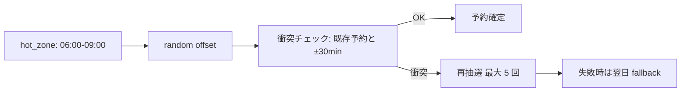

## 投稿頻度の変え方と「今日いらない」

> **対象読者**: cadence を調整したい顧客
> **前提**: light cadence で 1 週間以上回した
> **読了時間**: 約 5 分

cadence (投稿頻度) は **3 つの profile** から選びます。慣れるほど上げる、忙しい時期は下げる、というのが基本です。

## 1. 3 つの profile

| profile | 1 日 | 時間帯 (hot zones) | 推奨 |
| --- | --- | --- | --- |
| **light** | 1 本 | 06:00-09:00 JST のみ | 開始 1 ヶ月目 |
| **standard** | 2-3 本 | 朝 / 昼 / 夜 | 慣れてきた人 |
| **aggressive** | 4 本以上 | hot zones を広く活用 | 強く伸ばしたい人 |

## 2. 切り替え方

DM か mention で次のように話しかけます。

```text
あなた: 投稿ペース軽めにして
bot:    投稿ペースを Light に切り替えますか？
        [はい] [いいえ]
あなた: [はい]
bot:    ✅ Cadence を light に変更しました
```

| 言い方 | 結果 |
| --- | --- |
| 「軽めにして」「ペース下げて」 | light |
| 「普通に戻して」「standard で」 | standard |
| 「強めにして」「aggressive で」 | aggressive |

切替は確認ボタンが必ず出ます (destructive intent)。

## 3. hot_zones とは

各 profile に紐づく投稿可能な時間帯です。bot は hot_zones の中から **random offset (最大 ±30 分)** で時刻を選び、同時刻 ±30 分での衝突を回避します。



5 回失敗すると翌日の同じ hot_zone に fallback します (state.json に記録)。

## 4. 「今日いらない」 — skip_today

体調不良 / 出張 / 気分が乗らない日は今日の予約と draft 通知を一気に止められます。

```text
あなた: 今日いらない
bot:    今日の予約をすべて取り消しますか？
        [はい] [いいえ]
あなた: [はい]
bot:    ✅ 今日の予約を取り消しました (12:18 cancel × 1 件)
        翌日 06:00 から通常運用に戻ります
```

これは `state.skip_dates` に当日の YYYY-MM-DD を追加するだけで、cadence profile は変わりません。**翌日には自動で通常運用に戻ります**。

## 5. 数日まとめてスキップ

数日まとめてスキップしたい時は具体的に伝えます。

```text
あなた: 5/3 から 5/5 までスキップ
bot:    5/3, 5/4, 5/5 の予約と自動投稿をスキップしますか？
        [はい] [いいえ]
```

> 連休 / 出張モードのような専用状態は持っていません。skip_dates に列挙するだけで OK です。

## 6. 1 本だけ追加で出したい

cadence を上げずに 1 本だけ追加で出したい時は post.create を使います。

```text
あなた: 副業の話を 1 本書いて
bot:    📝 投稿案を作りました...
        [予約] [今すぐ投稿] [修正] [別案] [見送り]
```

`[予約]` を押すと既存の hot_zones の隙間に詰めます。`[今すぐ投稿]` は確認ボタン → publish。

## 7. 1 本だけ取り消したい

```text
あなた: 6:18 のやつ取り消して
bot:    6:18 の予約を取り消しますか？
        [はい] [いいえ]
```

`time_hint` が認識できない時は scope を聞き返します。

## 8. cadence と dedup の関係

cadence を上げても **dedup (重複防止)** は変わりません。

- 同 topic は過去 7 日 + 未来 7 日でチェック
- 本文先頭 80 文字 prefix 完全一致を block (`too_similar_recent`)

aggressive にしても 1 日に同じネタが連続することは無いです。詳しくは [developer/21-scheduler-and-dedup.md](../developer/21-scheduler-and-dedup.md) を参照。

## 9. 切り替え時の注意

- profile を上げた直後は draft 在庫が追いつかない場合があります (1 日 1 本生成 → 2-3 本生成への切替)
- 既存の予約は維持されたまま、新規生成だけが新 profile に従います
- 24h 以内に 2 回切り替えるのは推奨しません (急変は控えめに)
