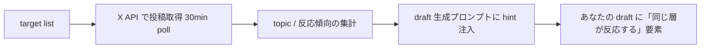

## 追跡対象 (target) の追加・削除

> **対象読者**: 「特定の人の投稿をきっかけに自分の投稿を作りたい」顧客
> **前提**: cadence と reply 判断の基本を理解
> **読了時間**: 約 5 分

target = MeX が **継続的に投稿を観察し、target discovery でネタの参考にしたり、関係構築に役立てたりする X アカウント** です。フォローしているかどうかは関係なく、独立して 1 つのリストとして持ちます。

## 1. target がやっていること



- target の最近の投稿 (URL / 本文 prefix / engagement) を draft 生成プロンプトに渡す
- ネタの方向性を寄せる材料に使う
- target の投稿に対する自分の reply 候補を提案することがある

target を **真似する** のではなく、**同じ層に届ける** ための参考情報です。

## 2. 追加する

```text
あなた: @tanaka_san を追加して
bot:    @tanaka_san を追跡対象に追加しました
        現在の target 数: 5
```

target 追加は表示系扱いで確認なしで進みます (account.json の targets 配列に append)。

## 3. 一覧

```text
あなた: ターゲット見せて
bot:    📋 追跡対象 (5)
        - @tanaka_san (2026-04-15 追加)
        - @yamada-san (2026-04-12 追加)
        - @sato_blog (2026-03-30 追加)
        ...
```

## 4. 削除

削除は destructive 扱いで確認が出ます。

```text
あなた: @tanaka_san を外して
bot:    @tanaka_san を追跡対象から外しますか？
        [はい] [いいえ]
あなた: [はい]
bot:    ✅ @tanaka_san を外しました
```

## 5. 何人くらいが目安か

| 数 | 性質 |
| --- | --- |
| 0-3 | 開始時 (まずあなた自身の voice を確立) |
| 5-10 | 推奨 (target discovery が機能する数) |
| 20+ | 多すぎ (X API quota 圧迫 + 集計ノイズ大) |

target が多すぎると、X API の rate limit (poll 30 分) で全員見きれなくなります。大事な人 5-10 名に絞るのを推奨。

## 6. handle の正規化

`@tanaka_san` でも `tanaka_san` でも同じものとして扱われます。bot が `@` や余計な記号を外して、X の handle として読める形に整えます。

```text
入力: 「@TANAKA_SAN!! を追加」
解釈: handle = TANAKA_SAN
```

ただし大文字小文字は X 側に従います (X 上は case-insensitive)。

## 7. target 起点の draft

target の最近の投稿で hot な topic があると、bot が朝の draft でそのテーマを取り上げることがあります。

```text
🟡 今日の draft (Posting v2)
  topic: 副業の続け方
  hint: @tanaka_san が「習慣化の壁」について書いていたので、
        同じ層に届く別角度を狙います
  candidate: 「ぼくは数字を毎週同じ時間に見るようにしてる…」
```

## 8. 自動化レベルごとの動き

target 起点の引用やリプライ候補は、自動化レベルで進み方が変わります。

| 自動化レベル | 動き |
| --- | --- |
| manual | 候補をためるだけ。あなたが「ターゲット見せて」「投稿作って」と頼んだ時に進む |
| semi_auto | bot が引用やリプライ候補を作り、Discord に確認を出す。あなたが承認してから投稿 |
| full_auto | 条件を満たした引用やリプライは bot が自動で作成・投稿まで進める。迷うものは確認に回る |

semi_auto では、Discord に候補が届いたら `[承認]` / `[見送り]` / 修正指示で判断します。full_auto にした直後は、最初の 1 日だけ通知を多めに見て、声や対象が合っているか確認してください。

## 9. target からの reply

target からのリプ / 引用は reply フローで個別 thread が立ちます (target だから優先するのではなく、内容の安全度で判定します)。

## 10. 削除と再追加

削除した相手を再追加するのは自由です。`state.json` には履歴が残るので、再追加しても過去の記録から学習を続けます。

## 11. target に向いていない相手

- 投稿頻度が極端に低い (月 1 程度) → 集計が薄い
- 自分と全く違う層 → hint がノイズになる
- bot / 自動投稿アカウント → 学ぶ価値が低い

迷う時は最初に少なめ (3-5 名) で始め、運用しながら入れ替えるのを推奨します。
