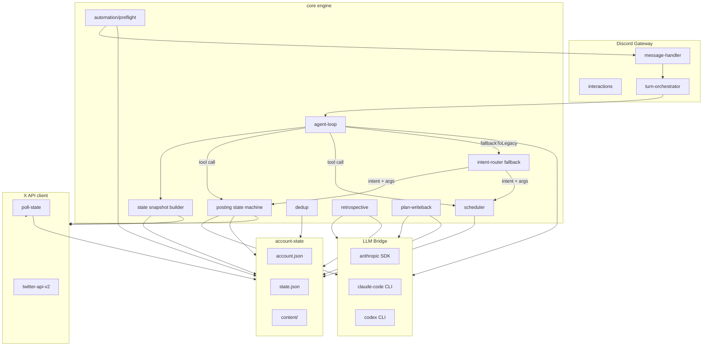
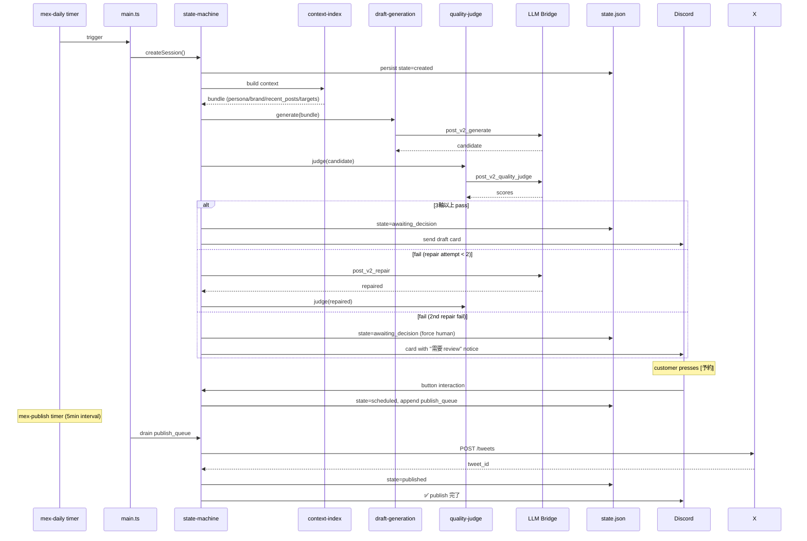
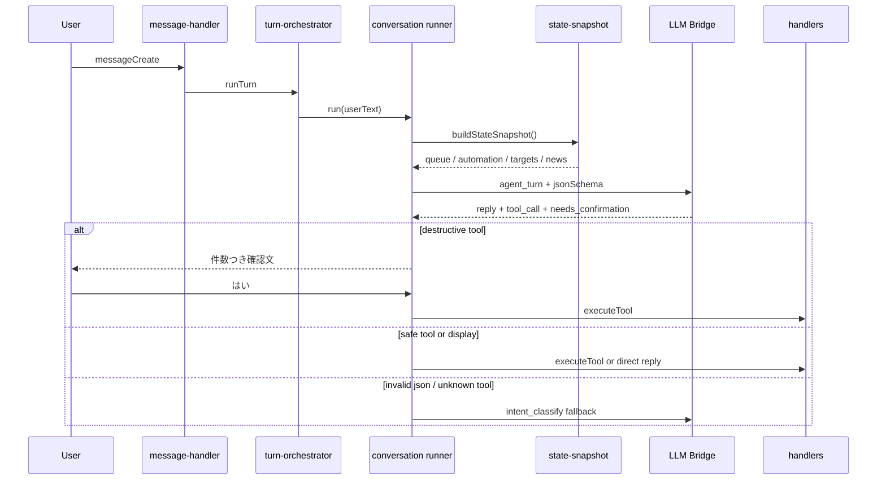
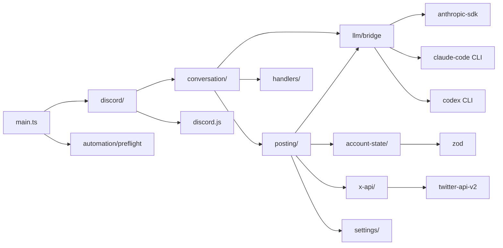

## Architecture Overview

> **対象読者**: developer (mex-next の中身を直す人)
> **前提**: TypeScript / Node.js / Discord bot 経験
> **読了時間**: 約 12 分

mex-next は X (Twitter) アカウントの運用 OS。投稿生成機ではなく、1 日中アカウントを回し続ける分散システムです。

## 1. High-level diagram



## 2. Module 構成

```text
src/
├── main.ts                       # bot entry, signal handling, DI wiring
├── config.ts                     # env / Doppler / argv parsing
├── account-state/                # repo I/O, zod schema, migration
│   ├── account-schema.ts
│   ├── state-schema.ts
│   ├── io.ts                     # read / atomic write / flock
│   ├── repo.ts                   # high-level repo facade (Repository pattern)
│   ├── schema-migration.ts       # default-injection for old state
│   └── plan-writeback.ts         # apply diff to account.json
├── automation/
│   ├── preflight.ts              # 10 hard gates
│   └── escalation.ts             # operator notify pipeline
├── conversation/
│   ├── turn-orchestrator.ts      # turn lock + cancel + recovery
│   ├── runner.ts                 # agent loop primary + legacy fallback dispatch
│   ├── intent-router.ts          # legacy natural-language → intent fallback
│   ├── conversation-locks.ts
│   ├── pending-confirmation-store.ts # legacy/tool confirmation union
│   ├── pending-turn-store.ts
│   ├── session-store.ts
│   └── turn-cancellation.ts
├── discord/
│   ├── client.ts                 # discord.js v14 wrapper
│   ├── message-handler.ts        # filter + dispatch
│   ├── interactions.ts           # slash + button + select
│   ├── confirmation.ts           # button-based confirm
│   ├── approval.ts               # one-shot approval store
│   ├── progress-indicator.ts     # ⏳ → ✅/❌ live update
│   ├── thread-lifecycle.ts       # auto-archive + revive
│   └── templates.ts              # card layouts
├── llm/
│   ├── agent-loop.ts             # state snapshot + tool catalog → structured action
│   ├── bridge.ts                 # provider router, timeout, retry
│   ├── state-snapshot.ts         # read-only conversation context
│   ├── anthropic-provider.ts
│   ├── claude-code-provider.ts
│   ├── codex-cli-provider.ts
│   ├── kinds.ts                  # LlmKind ↔ provider/timeout/maxtokens
│   ├── prompts.ts                # all system prompts
│   └── types.ts
├── observability/
│   └── logger.ts                 # pino structured log
├── posting/
│   ├── states.ts                 # state-machine constants + transitions
│   ├── state-machine.ts          # session lifecycle
│   ├── candidate.ts              # draft candidate model
│   ├── context-index.ts          # pre-LLM context bundle
│   ├── draft-generation.ts       # post_v2_generate wrapper
│   ├── quality-judge.ts          # 5-axis hard gate
│   ├── edit-diff.ts              # original→final diff for learning
│   ├── dedup.ts                  # topic + prefix block
│   ├── scheduler.ts              # hot zones + random offset + collision
│   ├── queue.ts                  # publish_queue
│   └── retrospective.ts          # daily/weekly/monthly/quarterly/half
├── settings/
│   ├── cadence.ts                # light/standard/aggressive
│   └── skip.ts                   # skip_today
├── x-api/
│   ├── client.ts                 # twitter-api-v2 wrapper
│   ├── poll-state.ts             # rate limit tracking
│   └── types.ts
└── utils/
    └── jst.ts                    # JST (UTC+9) date helpers
```

各 module は 200-400 行を目処、800 行を超えたら split。

## 3. データフロー (1 投稿 vertical slice)



## 4. 会話 primary path

Discord の自然文は agent loop が primary。legacy intent-router は fallback only。



## 5. 依存関係



依存方向は上流 → 下流のみ:

```text
main → discord → conversation → posting → llm/x-api/account-state/settings → utils
```

逆向きの import は禁止。

## 6. 不変方針 (DESIGN.md §1)

1. **repo が正本** ─ account.json / state.json
2. **core が頭脳** ─ LLM 呼出は bridge 経由
3. **Discord は control plane** ─ 顧客の唯一の窓
4. **1 顧客 = 1 VPS = 1 Discord bot**
5. **自然言語 primary、slash secondary**

## 7. 状態の境界

mutable な state は次の 3 ヶ所のみ:

| location | 何が住む | persistence |
| --- | --- | --- |
| `state.json` | posting_sessions, publish_queue, interaction_queue, inbound_reaction_sessions, skip_dates, x_api_rate_limit | atomic write + flock |
| in-memory | conversation locks, pending turn store, progress indicator, approval store | restart で消える (再構築可) |
| `account.json` | persona, brand, cadence, targets, goal_stack, half_focus, active_window | atomic write + flock |

**immutable**: `content/<id>/content.json` (publish 後は更新しない、archive のみ)

### 7.1 automation_level

`account.json` の `x_action_system.automation_level` は customer-facing の自動化レベル。agent loop の state snapshot に入り、reply の厚みと handler 側の dispatch 方針に影響する。

| level | 意味 |
| --- | --- |
| `manual` | 自動では出さず、session を貯める。顧客が手動で開始 |
| `semi_auto` | default。draft / reply / quote は Discord 承認を挟む |
| `full_auto` | 条件を満たす引用 RP / reply / publish を自動実行 |

## 8. 並行性

- Node.js single-threaded で event-loop ベース
- ファイル I/O は proper-lockfile で flock
- 同 account に対する複数 process 起動は禁止
- async handler は順序保証なし → conversation lock で 1 turn ずつ serialize

## 9. error 戦略

```typescript
// LLM 系の error は型で区別
class LlmTimeoutError extends Error {}
class LlmInvalidJsonError extends Error {}
class LlmProviderError extends Error {}

// X API は twitter-api-v2 が ApiResponseError を投げる
// → catch で rate_limit / authorization / network を区別
```

agent loop は invalid JSON / invalid shape / unknown tool / provider exception を `agent_loop_fallback` として記録し、legacy intent-router に委譲する。intent-router 側でも **すべての error を unknown intent fallback** で吸収し、顧客に internal error を出さない。

## 10. テスト

- vitest
- src と並行構造で `tests/unit/`
- LLM 呼出は mock (LlmProvider interface に対する fake)
- claude-code subprocess は execa で stub
- 80%+ coverage 目標

詳細: [50-testing.md](./50-testing.md)

## 11. 関連 docs

- [10-discord-conversation-engine.md](./10-discord-conversation-engine.md)
- [11-agent-loop.md](./11-agent-loop.md)
- [11-intent-router.md](./11-intent-router.md)
- [12-llm-bridge.md](./12-llm-bridge.md)
- [20-posting-state-machine.md](./20-posting-state-machine.md)
- [40-storage-and-migration.md](./40-storage-and-migration.md)
- [90-glossary.md](./90-glossary.md)
