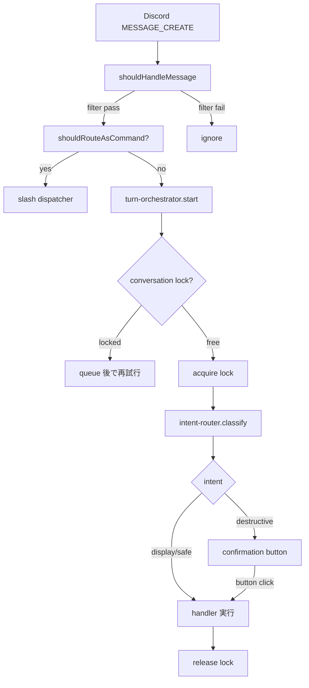
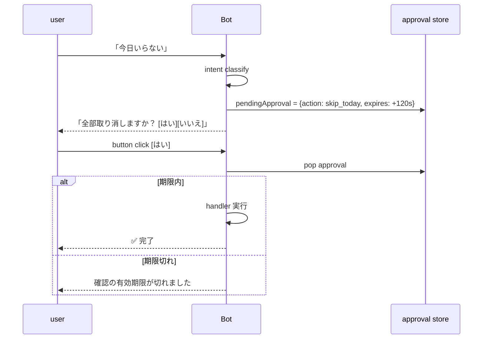
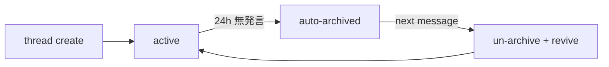

## Discord conversation engine (wah-office-v2 ported)

> **対象読者**: discord/ + conversation/ を直す developer
> **前提**: discord.js v14 の基礎、async/await
> **読了時間**: 約 10 分

`wah-office-v2` で完成していた対話エンジンを TypeScript で移植したものです。重要パターンと、mex-next 固有の調整を扱います。

## 1. 移植対応表

| pattern | wah-office-v2 (JS) | mex-next (TS) |
| --- | --- | --- |
| Message handler | `src/discord-message-handler.js` | `src/discord/message-handler.ts` |
| Conversation lock | `src/conversation-locks.js` | `src/conversation/conversation-locks.ts` |
| Pending turn store | `src/pending-turn-store.js` | `src/conversation/pending-turn-store.ts` |
| Turn orchestrator | `src/turn-orchestrator.js` | `src/conversation/turn-orchestrator.ts` |
| Progress indicator | `src/discord-status.js` | `src/discord/progress-indicator.ts` |
| Approval store | `src/approval-store.js` | `src/discord/approval.ts` |
| Reaction confirmation | `src/discord-confirmation.js` | `src/discord/confirmation.ts` |
| Thread lifecycle | `src/discord-thread-lifecycle.js` | `src/discord/thread-lifecycle.ts` |
| Auto-unarchive | `src/discord/auto-unarchive.js` | `src/discord/thread-lifecycle.ts` (統合) |
| Session store | `src/session-store.js` | `src/conversation/session-store.ts` |
| Judgment events | `src/judgment-events.js` | `src/observability/judgment-events.ts` |
| Operator allowlist | (config) | `src/config.ts` |

## 2. message → handler のフロー



### 2.1 shouldHandleMessage

`src/discord/message-handler.ts` の filter:

- DM: 常に handle
- guild channel: `@bot` mention 付き or operator allowlist 内
- bot 自分の発言は無視
- `/` で始まる = slash command (別 handler に dispatch)

### 2.2 turn-orchestrator

1 顧客 = 1 turn lock。並行発言は queue されて順次実行。
turn の途中でユーザーが新メッセージを送ると、進行中 turn を **cancel** して新 turn に切替 (turn-cancellation)。

```typescript
const result = await turnOrchestrator.run({
  userId,
  channelId,
  messageId,
  userText,
  handler: async (signal) => {
    // signal.aborted を時々チェックして cancel に応える
    return await intentRouter.classify({ userText, ... });
  },
});
```

### 2.3 conversation locks

`Map<userId, Promise<void>>` の単純 lock。`acquire(userId)` で前 turn の完了を await し、release されてから次 turn に進む。

```typescript
async function acquireLock(userId: string): Promise<() => void> {
  const previous = locks.get(userId) ?? Promise.resolve();
  let release!: () => void;
  const next = new Promise<void>((resolve) => { release = resolve; });
  locks.set(userId, previous.then(() => next));
  await previous;
  return release;
}
```

restart で全消失するが、顧客が新メッセージを送れば自然に復元。

## 3. progress indicator

長い処理 (LLM 呼出 + 5-axis judge + DB 書き込み) を 1 通の card で見せる:

```typescript
const card = await progressIndicator.start({
  channel,
  initialText: '⏳ 投稿案を生成しています...',
});
try {
  await heavyWork();
  await card.update('✅ 投稿案ができました\n...');
} catch (err) {
  await card.update('❌ エラーが発生しました');
  throw err;
}
```

Discord の rate limit (5 edits / 5s) を内部で respect。

## 4. confirmation flow

destructive intent には button confirmation を強制 (intent-router 側でも、この層でも保証)。



approval は in-memory (`Map<approvalId, { intent, args, expiresAt }>`)。120 秒で expire。

## 5. thread lifecycle

長期 thread (`[POST]`, `[RPLY]`, `[QREV]`, `[WREV]`, `[ALERT]`) の auto-archive 復活パターン:



discord.js が thread の archive を自動でやるので、mex-next 側は **archived thread を unarchive する** code を持つ。

```typescript
async function ensureUnarchived(thread: ThreadChannel): Promise<void> {
  if (thread.archived) {
    await thread.setArchived(false);
  }
}
```

## 6. session store (pending recovery)

bot restart 後に進行中の draft 編集 thread を再開する:

```typescript
// state.json の posting_sessions から ACTIVE_STATES のものを抽出
const activeSessions = state.posting_sessions
  .filter((s) => ACTIVE_STATES.has(s.state));

// 各 session の thread を pending として登録
for (const session of activeSessions) {
  pendingTurnStore.register({
    sessionId: session.id,
    threadId: session.thread_id,
    userId: session.customer_user_id,
  });
}
```

restart 後の 1st message でも、session が紐づいているので適切な flow に戻る。

## 7. judgment events (observability)

判断の追跡用に「いつ・誰の・どんな intent が・どう処理されたか」を構造化 log する。

```typescript
logger.info({
  kind: 'intent_judgement',
  user_id: userId,
  intent: result.intent,
  confirmation_needed: result.confirmationNeeded,
  fallback_reason: result.fallbackReason,
});
```

operator が `journalctl -o json | jq` で intent 系列の傾向を分析する用。

## 8. operator allowlist

DM 以外の channel での自然文応答は **OPERATOR_DISCORD_USER_IDS** の人だけ。
顧客には DM か `@bot` mention で十分。

```typescript
function shouldHandleMessage(msg: Message): boolean {
  if (msg.author.bot) return false;
  if (msg.channel.isDMBased()) return true;
  if (msg.mentions.has(client.user!.id)) return true;
  if (config.operatorAllowlist.has(msg.author.id)) return true;
  return false;
}
```

## 9. テストの mock 戦略

discord.js を直接 mock するのは骨が折れるので、`DiscordPoster` interface を切って handler を test する:

```typescript
interface DiscordPoster {
  sendMessage(channelId: string, content: string): Promise<{ messageId: string }>;
  editMessage(channelId: string, messageId: string, content: string): Promise<void>;
  createThread(channelId: string, name: string): Promise<{ threadId: string }>;
}
```

tests/unit では `InMemoryDiscordPoster` を使う。実 bot 起動は integration test で。

## 10. 関連 docs

- [11-intent-router.md](./11-intent-router.md)
- [00-architecture.md](./00-architecture.md)
- [50-testing.md](./50-testing.md)
