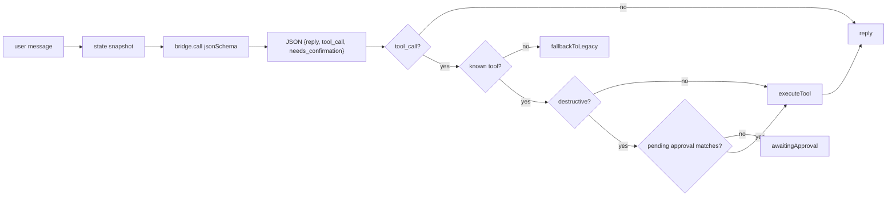
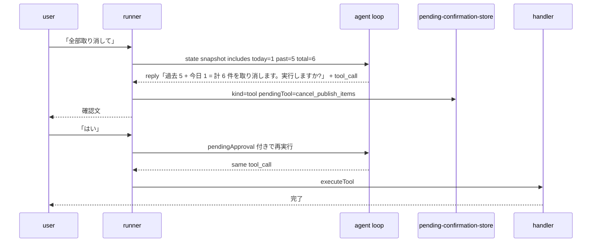

## agent loop — primary conversation path

> **対象読者**: `src/llm/agent-loop.ts` / `src/conversation/runner.ts` / handlers を直す developer
> **前提**: LLM bridge、Discord turn orchestration、handler layer の基礎
> **読了時間**: 約 12 分

agent loop は Discord 自然文会話の primary path。1 turn につき state snapshot を組み立て、LLM に JSON schema 付きで 1-shot structured output を要求し、必要なら tool を 1 つ実行する。legacy intent-router は agent loop が `fallbackToLegacy=true` を返した時だけ使う。

## 1. 全体図



`src/conversation/runner.ts` は turn ごとに `buildStateSnapshot()` を呼び、`AGENT_LOOP_SYSTEM`、`TOOL_SPECS`、直近 transcript、pending approval を `runAgentLoop()` に渡す。返り値は次の 4 パターン。

| result | meaning |
| --- | --- |
| `{ reply, trace: [] }` | 表示系。state snapshot だけで返答 |
| `{ reply, trace: [...] }` | safe tool を実行済み |
| `{ awaitingApproval }` | destructive tool を保留し、次 turn の「はい」を待つ |
| `{ fallbackToLegacy: true }` | unknown tool / invalid JSON / invalid shape などで legacy intent-router に委譲 |

## 2. state snapshot

`src/llm/state-snapshot.ts` は読み取り専用の会話用 state を作る。LLM が一覧・状態確認・ニュース表示を tool なしで返せるよう、必要な情報だけを小さく詰める。

| field | 内容 |
| --- | --- |
| `queue.today_active / past_active / total_active` | active な予約件数。「全部」確認時の件数根拠 |
| `queue.samples` | 最大 10 件の publish_id / scheduled_at / status / preview |
| `automation.enabled / level / cadence / skip_dates` | 自動運用の状態。`level` は `manual / semi_auto / full_auto` |
| `targets` | 追跡 handle 一覧 |
| `onboarding` | onboarding 中か、現在の question id |
| `account` | account id / display name |
| `news.trends / articles` | X トレンド上位 10 と `news_sources` 由来の記事上位 10 |

snapshot build は best-effort。X trends / RSS fetch は 5 秒 timeout で空配列に落とし、会話自体は止めない。

## 3. structured output

agent loop の schema は `src/handlers/tool-specs.ts` の `AGENT_RESPONSE_SCHEMA`。

```json
{
  "reply": "顧客向け返答。確認時は件数や対象を明示する",
  "tool_call": { "name": "cancel_publish_items", "input": { "scope": "all" } },
  "needs_confirmation": true
}
```

`tool_call=null` は表示・聞き返し・雑談など副作用なしの返答。`tool_call` がある場合も 1 turn で呼ぶ tool は 1 つだけ。model が catalog にない tool 名を返したら `unknown_tool` で fallback する。

provider ごとの jsonSchema 実装:

| provider | 実装方針 |
| --- | --- |
| Anthropic SDK | `tools=[emit_response]` + `tool_choice` 固定で native `tool_use` を強制。tool input を JSON string として取り出す。 |
| Claude Code CLI | system prompt に random fence 付き schema guide を追記し、JSON だけ返すよう soft-enforce。stdout から JSON を抽出する。 |
| Codex CLI | `--output-schema <schema.json>` を使い、入力側にも schema 指示を入れて soft-enforce。schema file は tmp に生成する。 |

## 4. tool catalog

`TOOL_SPECS` は agent loop が呼べる全操作の catalog。17 個すべてが handler に接続され、destructive flag で confirmation の有無を決める。

| tool | destructive | 意図 |
| --- | --- | --- |
| `cancel_publish_items` | yes | 予約の単体・今日全部・過去含む全部の取消 |
| `publish_now` | yes | 指定予約を今すぐ X に投稿 |
| `add_target_handle` | yes | 追跡対象 handle を追加 |
| `remove_target_handle` | yes | 追跡対象 handle を削除 |
| `enable_all_automation` | yes | approval gate を一括 auto 化 |
| `set_automation_level` | yes | `manual / semi_auto / full_auto` の切替 |
| `skip_today` | yes | 今日の予約・draft を止める |
| `set_cadence` | yes | 投稿ペース `light / standard / aggressive` の変更 |
| `create_post_draft` | no | topic から投稿 draft を生成 |
| `start_onboarding` | yes | 33 問 onboarding を開始 |
| `cancel_onboarding` | yes | 進行中 onboarding を中断 |
| `run_seed` | yes | 1-13 件の draft 一括生成 |
| `run_training` | yes | 過去投稿取り込みと voice 学習 |
| `start_phase_questionnaire` | yes | weekly / monthly / quarterly questionnaire を開始 |
| `run_system_update` | yes | operator 専用の自己更新 |
| `show_news_context` | no | 今日のニュースと X トレンド表示 |
| `regenerate_knowledge` | yes | operator 専用の knowledge files 再生成 |

operator-only は `run_system_update` と `regenerate_knowledge`。tool catalog には出すが、handler 側で `requesterUserId` を `OPERATOR_DISCORD_USER_IDS` と照合して拒否する。

## 5. confirmation flow

destructive tool は 2 turn に分ける。



件数は model の推測ではなく state snapshot の `queue` から作る。`cancel_publish_items` には `summarizeCancel()` もあり、`scope=all` なら「今日 N 件 + 過去 M 件 = 計 K 件」を作れる。

## 6. pending-confirmation-store

`src/conversation/pending-confirmation-store.ts` は in-memory / 5 分 TTL。restart で消えるが、破壊的操作が勝手に再実行されない方向なので安全。

```typescript
type PendingConfirmation =
  | {
      kind: 'legacy';
      intent: IntentName;
      args: Record<string, unknown>;
      promptShown: string;
    }
  | {
      kind: 'tool';
      pendingTool: { name: string; input: Record<string, unknown> };
      promptShown: string;
    };
```

`はい / yes / 実行 / 進めて` は affirmative、`いいえ / no / キャンセル / やめて` は negative。曖昧な返答は pending を捨てて通常会話へ戻す。

## 7. fallback

fallback は defensive coverage。主な入口:

- provider output が JSON として読めない: `invalid_json`
- schema shape が壊れている: `invalid_shape`
- tool catalog にない名前: `unknown_tool`
- bridge/provider exception: runner が catch して legacy intent-router

fallback 時は judgment event `agent_loop_fallback` を出す。連続発生は provider 設定、schema prompt、tool catalog mismatch を疑う。

## 8. prompt 設計

`AGENT_LOOP_SYSTEM` は intent classifier ではなく「顧客と会話しながら必要な操作だけ選ぶ」prompt。

- 顧客語彙を echo する。「全部取り消して」なら reply にも「全部」を含め、解釈を明示する
- destructive 操作は件数・対象を明示して聞く
- 曖昧な要求は聞き返す。型に押し込まない
- read-only は state snapshot から直接返す
- `manual` は確認を厚く、`full_auto` は判断材料を簡潔にする
- news / trends は関連する時だけ自然に使う

`AGENT_LOOP_SYSTEM` が primary、`INTENT_CLASSIFY_SYSTEM` は legacy fallback 専用。

## 9. 関連 docs

- [10-discord-conversation-engine.md](./10-discord-conversation-engine.md)
- [11-intent-router.md](./11-intent-router.md)
- [12-llm-bridge.md](./12-llm-bridge.md)
- [00-architecture.md](./00-architecture.md)
