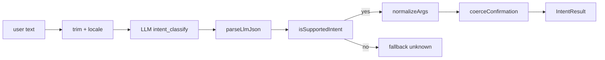

## intent router — 自然言語 → intent

> ⚠️ **Legacy fallback only.** New conversation paths go through the
> tool-calling agent loop in `src/llm/agent-loop.ts`. This document
> describes the intent-router that survives only as a fallback when
> the agent loop returns `fallbackToLegacy=true` (anthropic SDK
> unavailable, or unknown_tool / invalid_json from the provider).
> See [11-agent-loop.md](./11-agent-loop.md) for the primary path.

> **対象読者**: conversation/intent-router.ts を直す developer
> **前提**: LLM prompt 設計の基礎
> **読了時間**: 約 8 分

自然文の Discord メッセージを構造化 intent に変える legacy module。`src/conversation/intent-router.ts`。
通常の新規 conversation turn は `src/llm/agent-loop.ts` が state snapshot + tool catalog を使って処理し、intent-router は agent loop が安全に判断できなかった場合だけ呼ばれる。

## 1. 全体図



## 2. legacy supported intents

`src/conversation/intent-router.ts` 抜粋:

```typescript
export type IntentName =
  | 'schedule.list'
  | 'schedule.cancel'
  | 'schedule.publish_now'
  | 'schedule.detail'
  | 'post.create'
  | 'target.add'
  | 'target.list'
  | 'target.remove'
  | 'automation.status'
  | 'automation.enable_all'
  | 'cadence.set_light'
  | 'cadence.set_standard'
  | 'cadence.set_aggressive'
  | 'cadence.skip_today'
  | 'status.show'
  | 'help.show'
  | 'unknown';
```

新しい操作を足す場合は原則 `src/handlers/tool-specs.ts` の tool catalog に追加する。intent-router へ intent を足すのは、agent loop fallback でも同じ操作を扱う必要がある場合だけ。

legacy intent を足す場合:

1. `IntentName` union に追加
2. `SUPPORTED_INTENTS` set に追加
3. `prompts.ts` の `INTENT_CLASSIFY_SYSTEM` に説明 + 例を追加
4. `DESTRUCTIVE_INTENTS` / `DISPLAY_INTENTS` に必要に応じて追加
5. `normalizeArgs` で args の正規化を実装
6. `defaultConfirmationMessage` で確認文を実装
7. test を `tests/unit/conversation/intent-router.test.ts` に追加
8. handler を `src/discord/interactions.ts` などに wire

## 3. destructive whitelist (重要な safety)

LLM が hallucinate して「確認不要」と返しても、この whitelist が **必ず confirmation を強制** します。

```typescript
export const DESTRUCTIVE_INTENTS: ReadonlySet<IntentName> = new Set<IntentName>([
  'schedule.cancel',
  'schedule.publish_now',
  'target.remove',
  'automation.enable_all',
  'cadence.skip_today',
  'cadence.set_light',
  'cadence.set_standard',
  'cadence.set_aggressive',
]);
```

逆に display intents は LLM が `confirmation_needed=true` と返しても無視されて確認なしで進みます。

```typescript
export const DISPLAY_INTENTS: ReadonlySet<IntentName> = new Set<IntentName>([
  'schedule.list',
  'schedule.detail',
  'target.list',
  'automation.status',
  'status.show',
  'help.show',
]);
```

`coerceConfirmation` 内で順序が大事:

```typescript
function coerceConfirmation(intent, raw, args) {
  if (DISPLAY_INTENTS.has(intent)) {
    return { confirmationNeeded: false };  // display は強制 false
  }
  let needed = Boolean(raw.confirmation_needed);
  if (DESTRUCTIVE_INTENTS.has(intent)) {
    needed = true;  // destructive は強制 true
  }
  // ...
}
```

## 4. prompt 設計 (`src/llm/prompts.ts`)

`INTENT_CLASSIFY_SYSTEM` の構造:

```text
あなたは X 運用 OS の自然言語インテント分類器です。
ユーザーのメッセージを次の intent に分類し、JSON で返してください。

## 出力フォーマット
{
  "intent": "<IntentName>",
  "args": {...},
  "confirmation_needed": <boolean>,
  "confirmation_message": "<日本語>"
}

## intents
- schedule.list: 予約一覧を見せる
- schedule.cancel: 予約取り消し (args: { time_hint: "HH:MM", scope: "one"|"today_all", publish_id?: string })
- ...

## ルール
- destructive な操作 (取消・公開・削除・ペース変更) は confirmation_needed=true
- 表示系は confirmation_needed=false
- 不確実な場合は intent="unknown"

## 例
入力: 「予約見せて」
出力: {"intent": "schedule.list", "args": {}, "confirmation_needed": false}

入力: 「6:18 のやつ取り消して」
出力: {"intent": "schedule.cancel", "args": {"time_hint": "06:18", "scope": "one"}, "confirmation_needed": true, "confirmation_message": "06:18 の予約を取り消しますか？"}
```

prompt cache が効くように **system prompt は固定**、user 入力だけ可変。

## 5. argument 正規化

LLM が出した args は信用しすぎず、`normalizeArgs` で整形:

```typescript
// handle: "@TANAKA_san!!" → "TANAKA_san"
function normalizeHandle(value: unknown): string {
  let text = String(value ?? '').trim();
  if (text.startsWith('@')) text = text.slice(1);
  text = text.split(/\s+/)[0] ?? '';
  return text.replace(/[^A-Za-z0-9_]/g, '');
}

// time_hint: "6:18" → "06:18"
if (/^\d{1,2}:\d{2}$/.test(timeHint)) {
  const [hh, mm] = timeHint.split(':');
  cleaned.time_hint = `${pad(hh)}:${pad(mm)}`;
}

// topic: 120 文字で切る
if (topic) cleaned.topic = topic.slice(0, 120);
```

unknown key は drop。型チェックを通った値だけ通す。

## 6. fallback

LLM 失敗時はすべて unknown intent + 顧客向けメッセージで吸収:

| reason | 引き金 |
| --- | --- |
| `empty_input` | trim 後 0 文字 |
| `timeout` | LlmTimeoutError |
| `provider_error` | その他の bridge エラー |
| `invalid_json` | JSON parse 失敗 |
| `unsupported_intent` | LLM が架空 intent を返した |

すべてに同じ顧客向けメッセージ:

```text
うまく聞き取れませんでした。
「予約見せて」「6:18のやつ取り消して」「今日は投稿いらない」のように書いてください。
詳しい操作は `/mex help` でも見られます。
```

ログには `fallback_reason` を載せて operator が傾向分析できるように。

## 7. JSON parse のしぶとさ

LLM が ```` ```json ``` ```` で wrap して返すケースに対応:

```typescript
function stripCodeFence(raw: string): string {
  const trimmed = raw.trim();
  if (trimmed.startsWith('```')) {
    const firstNewline = trimmed.indexOf('\n');
    const closeIdx = trimmed.lastIndexOf('```');
    return trimmed.slice(firstNewline + 1, closeIdx).trim();
  }
  return trimmed;
}
```

それでも parse 失敗 → invalid_json fallback で安全側に倒す。

## 8. provider 選定

intent_classify は fallback path の **lightweight** classify。Anthropic SDK 直接、prompt caching ON。

| kind | provider | timeout | maxtokens |
| --- | --- | --- | --- |
| intent_classify | anthropic | 8s | 600 |

primary path の `agent_turn` は [11-agent-loop.md](./11-agent-loop.md) を参照。LLM bridge の詳細は [12-llm-bridge.md](./12-llm-bridge.md)。

## 9. テスト戦略

```typescript
// LLM provider の mock
const fakeBridge: LlmProvider = {
  call: vi.fn().mockResolvedValue({ text: '{"intent":"schedule.list","args":{},"confirmation_needed":false}' }),
};

const result = await classifyIntent({ userText: '予約見せて', bridge: fakeBridge });
expect(result.intent).toBe('schedule.list');
expect(result.confirmationNeeded).toBe(false);
```

destructive override の test:

```typescript
// LLM が confirmation_needed=false を返しても、強制 true
const fakeBridge = mockLlm('{"intent":"schedule.cancel","confirmation_needed":false}');
const result = await classifyIntent({ userText: '取消', bridge: fakeBridge });
expect(result.confirmationNeeded).toBe(true);  // overridden
```

## 10. 関連 docs

- [11-agent-loop.md](./11-agent-loop.md)
- [12-llm-bridge.md](./12-llm-bridge.md)
- [10-discord-conversation-engine.md](./10-discord-conversation-engine.md)
- [00-architecture.md](./00-architecture.md)
