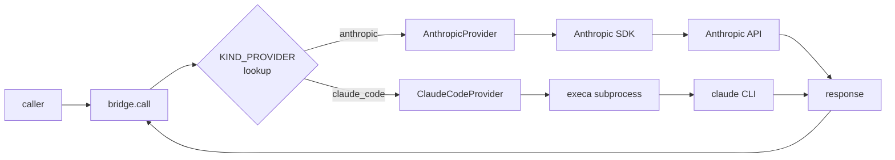

## LLM Bridge — anthropic SDK + claude-code CLI

> **対象読者**: src/llm/ を直す developer
> **前提**: Anthropic API、prompt caching の概念
> **読了時間**: 約 9 分

bridge はすべての LLM 呼出の単一窓口。kind ごとに provider / timeout / maxtokens / cache を切り替えます。

## 1. 全体図



## 2. LlmKind と metadata

`src/llm/kinds.ts` で 13 種類の kind を定義:

| kind | provider | timeout | max_tokens | cache |
| --- | --- | --- | --- | --- |
| intent_classify | anthropic | 8s | 600 | yes |
| inbound_risk_classify | anthropic | 8s | 500 | yes |
| inbound_reply_draft | claude_code | 30s | 800 | yes |
| post_v2_generate | claude_code | 60s | 1200 | yes |
| post_v2_quality_judge | claude_code | 30s | 800 | yes |
| post_v2_repair | claude_code | 45s | 1200 | yes |
| post_v2_revise | claude_code | 45s | 1000 | yes |
| quote_v2_generate | claude_code | 30s | 600 | yes |
| quote_v2_edit | claude_code | 30s | 500 | yes |
| periodic_retrospective_generate | claude_code | 90s | 2400 | no |
| periodic_retrospective_apply | claude_code | 60s | 1500 | no |
| plan_writeback_diff | claude_code | 45s | 1500 | no |
| plan_writeback_apply | claude_code | 45s | 1500 | no |

新しい kind を足す手順:

1. `LlmKind` union に追加
2. `ALL_LLM_KINDS` に追加
3. `KIND_TIMEOUT_MS`, `KIND_MAX_TOKENS`, `KIND_PROVIDER`, `KIND_CACHE_DEFAULT` の各 record に追加 (TS が型エラーで足りない record を教える)
4. `prompts.ts` に system prompt を実装
5. test を `tests/unit/llm/bridge.test.ts` に追加

## 3. provider の使い分け

### 3.1 anthropic SDK 直接

短い classify (intent / risk) に使用。**low latency が最優先**、prompt caching が最大効果。

```typescript
const client = new Anthropic({ apiKey });
const message = await client.messages.create({
  model: 'claude-sonnet-4-5',
  max_tokens: 600,
  system: [
    { type: 'text', text: INTENT_CLASSIFY_SYSTEM, cache_control: { type: 'ephemeral' } },
  ],
  messages: [{ role: 'user', content: userText }],
});
```

cache_control: ephemeral で 5 分 TTL の prompt cache が効く。同じ system prompt + user 入力可変なら cache hit 率は理論上ほぼ 100%。

### 3.2 claude-code CLI subprocess

長い "thinking" タスクに使用。execa で起動。

```typescript
const result = await execa('claude', [
  '--max-tokens', '1200',
  '--output-format', 'json',
], {
  input: JSON.stringify({ system, user, ... }),
  timeout: 60_000,
});
const parsed = JSON.parse(result.stdout);
```

### 3.3 なぜ 2 系統か

| 観点 | anthropic SDK | claude-code CLI |
| --- | --- | --- |
| latency | < 5s | 10-60s |
| context | ~200K | ~1M+ |
| tools (file read 等) | 自分で書く | 内蔵 |
| cost | 普通 | OAuth subscription 利用なら subscription 内 |
| reliability | API 直 | subprocess の起動コスト |

軽量 + 頻繁 → SDK / 重い思考 → CLI が住み分け。

## 4. prompt caching の実装

`src/llm/anthropic-provider.ts`:

```typescript
async call(req: LlmRequest): Promise<LlmResponse> {
  const cache = KIND_CACHE_DEFAULT[req.kind];
  const system = cache
    ? [
        { type: 'text', text: req.systemPrompt, cache_control: { type: 'ephemeral' } },
      ]
    : req.systemPrompt;

  const message = await this.client.messages.create({
    model: this.model,
    max_tokens: KIND_MAX_TOKENS[req.kind],
    system,
    messages: [{ role: 'user', content: req.userPrompt }],
  });

  return {
    text: message.content.map(c => c.type === 'text' ? c.text : '').join(''),
    usage: {
      input_tokens: message.usage.input_tokens,
      output_tokens: message.usage.output_tokens,
      cache_read_tokens: message.usage.cache_read_input_tokens,
      cache_create_tokens: message.usage.cache_creation_input_tokens,
    },
  };
}
```

cache 効果は usage で測定可能 (`cache_read_tokens` が input_tokens の大部分なら hit している)。

## 5. timeout / retry

```typescript
async function callWithTimeout<T>(promise: Promise<T>, ms: number): Promise<T> {
  const timer = new Promise<never>((_, reject) =>
    setTimeout(() => reject(new LlmTimeoutError()), ms),
  );
  return Promise.race([promise, timer]);
}
```

retry は **しない**。LLM 呼出は副作用なし (idempotent) だが、retry は呼出元で判断。intent_classify は失敗時 unknown fallback で十分。

## 6. error 型

```typescript
export class LlmTimeoutError extends Error {
  constructor() { super('llm timeout'); }
}
export class LlmInvalidJsonError extends Error {}
export class LlmProviderError extends Error {}
```

caller (intent-router 等) は型で分岐可能。

## 7. 構造化 log

bridge は呼出ごとに kind / duration / tokens を log:

```typescript
logger.info({
  kind: req.kind,
  provider: KIND_PROVIDER[req.kind],
  duration_ms: Date.now() - startedAt,
  input_tokens: usage.input_tokens,
  output_tokens: usage.output_tokens,
  cache_read_tokens: usage.cache_read_tokens,
});
```

operator が「intent_classify がキャッシュ効いてるか」を `journalctl -o json | jq 'select(.kind=="intent_classify") | .cache_read_tokens'` で確認できる。

## 8. テスト戦略

`LlmProvider` interface を mock:

```typescript
class FakeLlmProvider implements LlmProvider {
  responses = new Map<LlmKind, string>();
  async call(req: LlmRequest): Promise<LlmResponse> {
    const text = this.responses.get(req.kind) ?? '{"intent":"unknown"}';
    return { text };
  }
}

const fake = new FakeLlmProvider();
fake.responses.set('intent_classify', '{"intent":"schedule.list"}');
```

claude-code subprocess は execa を vi.mock で stub。

```typescript
vi.mock('execa', () => ({
  execa: vi.fn().mockResolvedValue({ stdout: '{"text":"..."}'}),
}));
```

## 9. cost & quota 監視

operator が見るべき:

- **input_tokens × $/1M** (claude-sonnet-4-5: $3 / 1M)
- **output_tokens × $/1M** (output: $15 / 1M)
- **cache_read_tokens** (90% 割引)
- **cache_create_tokens** (1.25x 通常 input)

詳細: [../operator/21-monitoring.md](../operator/21-monitoring.md)

## 10. 関連 docs

- [11-intent-router.md](./11-intent-router.md)
- [00-architecture.md](./00-architecture.md)
- [50-testing.md](./50-testing.md)
