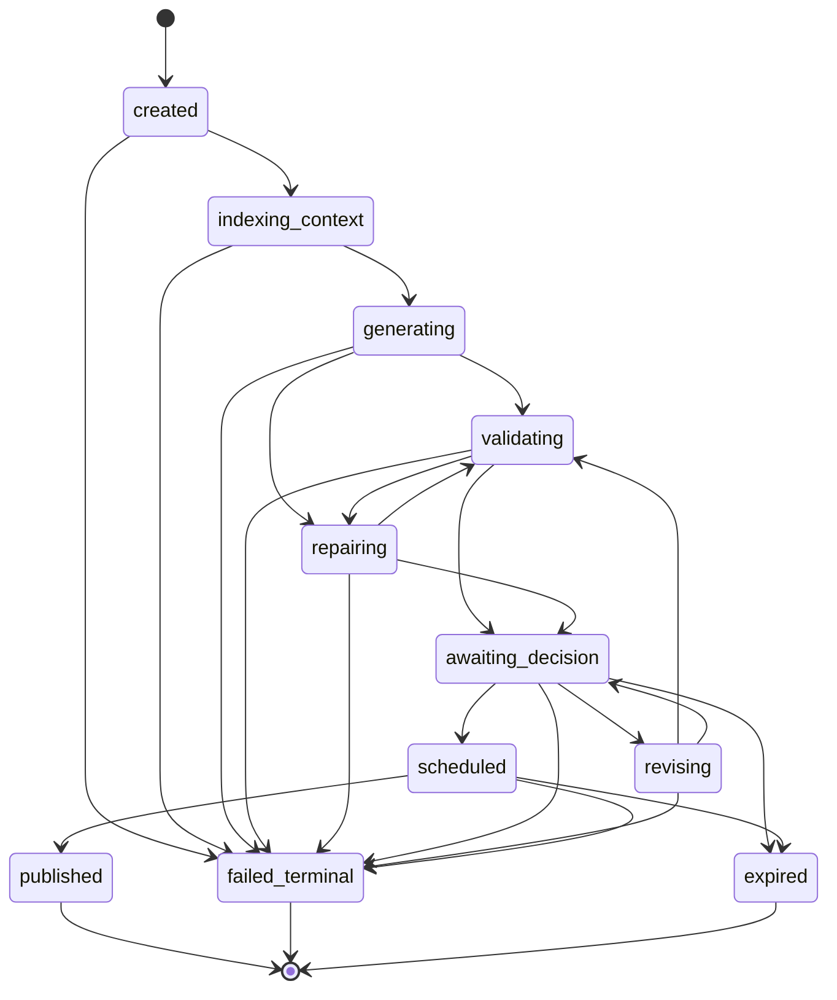
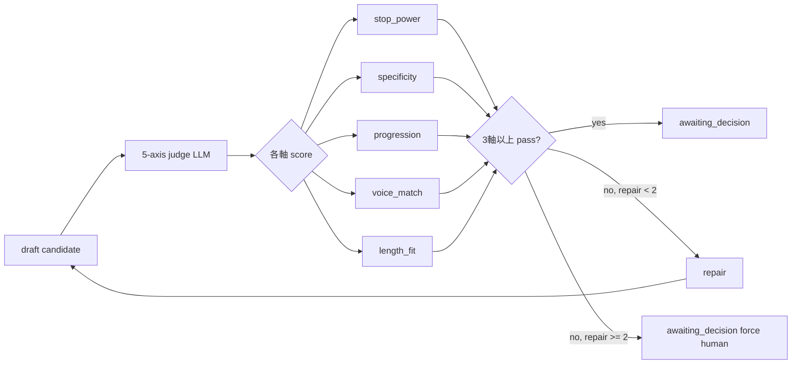

## Posting v2 state machine

> **対象読者**: src/posting/ を直す developer
> **前提**: 状態機械の基礎、async/await
> **読了時間**: 約 12 分

1 投稿 = 1 session = 1 つの状態機械。`src/posting/state-machine.ts` + `src/posting/states.ts`。

## 1. 11 状態の遷移図



各状態の意味:

| 状態 | 意味 |
| --- | --- |
| `created` | session 作成のみ |
| `indexing_context` | LLM 用の context 構築中 |
| `generating` | LLM で draft 生成中 |
| `validating` | 5-axis 品質判定 |
| `repairing` | quality fail で auto-repair |
| `awaiting_decision` | 顧客の判断待ち (button) |
| `revising` | 顧客の修正指示で regenerate |
| `scheduled` | publish_queue に投入済み |
| `published` | 終端: X に投稿済み |
| `failed_terminal` | 終端: 諦めた |
| `expired` | 終端: 24h TTL elapsed |

## 2. 遷移検証

`states.ts` の `VALID_TRANSITIONS` matrix で許可遷移を定義。違反時は throw:

```typescript
export function assertTransition(from: PostingState, to: PostingState): void {
  if (!canTransition(from, to)) {
    throw new Error(`invalid posting transition: ${from} -> ${to}`);
  }
}
```

state 変更は必ず `assertTransition` を通すこと。直接 `session.state = '...'` は禁止。

## 3. 5-axis 品質 judge (hard gate)

`src/posting/quality-judge.ts`。Posting v2 の核。



各軸 0-5 点、3 点以上 = pass:

| 軸 | 何を見るか |
| --- | --- |
| `stop_power` | 最初の 1 行で読者を止められるか |
| `specificity` | 抽象論で逃げてないか |
| `progression` | 起承転結 / 流れ |
| `voice_match` | 顧客の声に合っているか |
| `length_fit` | 280 文字制限で破綻してないか |

3 軸以上 pass で hard gate 通過。

repair 試行は **最大 2 回**。それでも fail なら `awaiting_decision` に強制遷移して人間判断に委ねる (`awaiting_decision_with_quality_warning` ではなく素の awaiting_decision として、card に "review needed" 注釈を出す)。

## 4. context-index

LLM に投げる前の **context bundle** を組み立てる。

```typescript
interface ContextBundle {
  persona: string;          // 顧客の文体ガイド
  brand: string;            // ブランドの方向性
  active_window: string;    // 今月の主軸
  goal_stack: string[];     // 直近の目標
  recent_posts: string[];   // dedup 用、過去 7 日
  upcoming_topics: string[]; // dedup 用、未来 7 日に予約済 topic
  edit_diffs: EditDiff[];   // 過去の修正学習
  target_signals: string[]; // target の最近 hot な topic
  cadence: Cadence;
}
```

`src/posting/context-index.ts` で組み立て。state.json + account.json から純粋関数で生成。

## 5. draft-generation

`post_v2_generate` LLM 呼出のラッパー。

```typescript
export async function generateDraft(
  bundle: ContextBundle,
  bridge: LlmProvider,
): Promise<Candidate> {
  const response = await bridge.call({
    kind: 'post_v2_generate',
    systemPrompt: buildPostV2GenerateSystem(bundle.persona, bundle.brand),
    userPrompt: buildPostV2GenerateUser(bundle),
  });
  return parseCandidate(response.text);
}
```

system prompt は **persona + brand** で構成 → cache 効く。
user prompt は 1 投稿ごとに毎回違う → cache 効かない部分。

## 6. repair / revise の違い

| 動作 | 引き金 | LLM kind | input |
| --- | --- | --- | --- |
| `repairing` | 5-axis fail (auto) | post_v2_repair | original + 何が落ちたか |
| `revising` | 顧客の指示 (manual) | post_v2_revise | original + 顧客の指示文 |

両方とも **新しい candidate を作る** 動作で、validating に戻る。

## 7. edit-diff 学習ループ

顧客の修正前後 (`original` → `final`) を `compute_edit_diff` で記録し、以降の draft 生成で「過去の修正パターン」を hint として渡す。

```typescript
interface EditDiff {
  session_id: string;
  original: string;
  final: string;
  delta: string;        // 自然言語による要約
  applied_at: string;   // ISO8601
}
```

context-index で直近 5-10 件を bundle.edit_diffs に詰めて prompt に注入。

詳細: [22-retrospective-and-writeback.md](./22-retrospective-and-writeback.md) (※ 別 module だが似た学習ループあり)

## 8. session TTL

`DEFAULT_SESSION_TTL_HOURS = 24`。

```typescript
function maybeExpire(session: PostingSession, now: Date): PostingSession {
  if (TERMINAL_STATES.has(session.state)) return session;
  const ageHours = (now.getTime() - new Date(session.created_at).getTime()) / 3600_000;
  if (ageHours >= DEFAULT_SESSION_TTL_HOURS) {
    return { ...session, state: 'expired' };
  }
  return session;
}
```

bot 起動時 + 各 timer trigger で expire 判定。expired 通知は出すが、放置でも害はない。

## 9. publish

`scheduled` → `published` の遷移は publish 専用 timer (`mex-publish-<id>.timer`, 5min interval) が drain。

```typescript
async function drainPublishQueue(state: AccountState): Promise<AccountState> {
  const due = state.publish_queue.filter(item => item.publish_at <= now);
  for (const item of due) {
    try {
      const tweetId = await xApi.postTweet(item.text);
      state = updateSession(state, item.session_id, s => ({
        ...s,
        state: 'published',
        published_at: now.toISOString(),
        tweet_id: tweetId,
      }));
    } catch (err) {
      state = recordFailure(state, item.session_id, err);
    }
  }
  return state;
}
```

publish 失敗:

- 1 回目: 記録のみ
- 2 回目: 記録のみ + retry
- 3 回目: `failed_terminal` + operator escalate

## 10. immutability

state machine は **すべて純粋関数 + immutable** で実装:

```typescript
export function transitionTo(
  session: Readonly<PostingSession>,
  to: PostingState,
  now: Date,
): PostingSession {
  assertTransition(session.state, to);
  return {
    ...session,
    state: to,
    transitions: [...session.transitions, { from: session.state, to, at: now.toISOString() }],
  };
}
```

state.json は repo 経由で `repo.update(state => newState)` の形で書く。

## 11. テスト

純粋関数なので test しやすい:

```typescript
test('valid transition: created → indexing_context', () => {
  expect(canTransition('created', 'indexing_context')).toBe(true);
});

test('invalid transition: created → scheduled (skip)', () => {
  expect(canTransition('created', 'scheduled')).toBe(false);
});

test('5-axis judge: 3 pass = gate', async () => {
  const candidate = { text: '...' };
  const judge = await qualityJudge(candidate, fakeBridge);
  expect(passedAxes(judge)).toBeGreaterThanOrEqual(3);
});
```

## 12. 関連 docs

- [21-scheduler-and-dedup.md](./21-scheduler-and-dedup.md)
- [22-retrospective-and-writeback.md](./22-retrospective-and-writeback.md)
- [12-llm-bridge.md](./12-llm-bridge.md)
- [00-architecture.md](./00-architecture.md)
