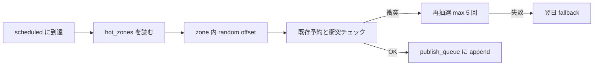
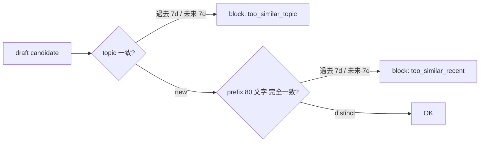

## Scheduler & Dedup

> **対象読者**: src/posting/scheduler.ts + dedup.ts を直す developer
> **前提**: state machine、cadence
> **読了時間**: 約 8 分

scheduler は「何を出すか」が決まった後の「いつ出すか」担当。dedup は「同じネタが連続しないか」担当。

## 1. scheduler の責務



```typescript
interface ScheduleResult {
  publish_at: string;     // ISO8601
  zone: HotZone;
  attempt: number;        // 1..5
  fallback_reason?: 'collision_max' | 'rate_limited';
}
```

## 2. hot_zones

cadence profile に応じて時間帯を持つ:

```typescript
const HOT_ZONES_BY_PROFILE: Record<CadenceProfile, HotZone[]> = {
  light: [
    { start: '06:00', end: '09:00' },
  ],
  standard: [
    { start: '06:00', end: '09:00' },
    { start: '11:00', end: '13:00' },
    { start: '20:00', end: '22:00' },
  ],
  aggressive: [
    { start: '06:00', end: '09:00' },
    { start: '11:00', end: '13:00' },
    { start: '15:00', end: '17:00' },
    { start: '20:00', end: '23:00' },
  ],
};
```

各 zone 内で random pick → ±30 min の offset を適用 (zone 端は zone 内に clamp)。

## 3. 同時刻 ±30min 衝突回避

新予約が既存 publish_queue の item と ±30min 以内なら衝突:

```typescript
function hasCollision(when: Date, queue: PublishQueueItem[]): boolean {
  const margin = 30 * 60 * 1000;
  return queue.some(item => {
    const diff = Math.abs(when.getTime() - new Date(item.publish_at).getTime());
    return diff < margin;
  });
}
```

衝突したら same zone 内で 5 回まで再抽選、それでも失敗なら翌日 fallback (zone を維持して日付を +1)。

## 4. 翌日 fallback

```typescript
if (attempts >= 5) {
  const tomorrow = addDays(today, 1);
  return scheduleInZone(zone, tomorrow, queue, 1);
}
```

fallback は state.json の `scheduling_log` に記録 → operator が trend を analyse できる。

## 5. dedup の責務

同 topic / 同 prefix の連続 publish を防ぐ。



実装は `src/posting/dedup.ts`:

```typescript
export function isDuplicate(
  candidate: Candidate,
  state: AccountState,
  now: Date,
): DedupResult {
  const window = 7 * 24 * 60 * 60 * 1000;
  const recentTopics = collectRecentTopics(state, now, window);
  if (recentTopics.has(candidate.topic)) {
    return { blocked: true, reason: 'too_similar_topic' };
  }
  const prefix = candidate.text.slice(0, 80);
  const recentPrefixes = collectRecentPrefixes(state, now, window);
  if (recentPrefixes.has(prefix)) {
    return { blocked: true, reason: 'too_similar_recent' };
  }
  return { blocked: false };
}
```

## 6. dedup の prompt 注入

LLM 側にも先回りで「直近 7 日の topic と prefix」を渡し、生成時点で被らせない:

```typescript
const userPrompt = `
最近書いた topics (avoid):
${recentTopics.map(t => '- ' + t).join('\n')}

最近書いた本文 prefix (avoid):
${recentPrefixes.map(p => '- "' + p + '..."').join('\n')}

今日の topic を新しく出してください。
`;
```

## 7. publish_queue の構造

```typescript
interface PublishQueueItem {
  publish_id: string;        // pub-xxxx
  session_id: string;        // s-xxxx
  text: string;
  publish_at: string;        // ISO8601
  attempt: number;           // 0..2
  last_error?: string;
}
```

`publish_at` で sort、5 分間隔の publish timer が due な item を drain。

## 8. cadence の切替時の振る舞い

cadence を `standard → light` に下げた時、既存予約は **そのまま** (顧客の意図が「明日からゆるく」のため)。

cadence を `light → aggressive` に上げた時も、既存予約はそのまま。新規生成だけ aggressive の hot_zones を使う。

## 9. skip_today の効果

`state.skip_dates` に YYYY-MM-DD が入っていると:

- 当日生成された draft は scheduler が `skip_today_active` で reject
- 既存の publish_queue の同日 item は cancel
- 翌日 00:00 で skip_today は自動失効

## 10. テスト

`scheduler.test.ts`:

```typescript
test('light cadence picks within 06:00-09:00', () => {
  const result = scheduleNew('light', existingQueue, today);
  expect(parseTime(result.publish_at)).toBeBetween('06:00', '09:00');
});

test('collision triggers fallback after 5 attempts', () => {
  const queue = makeFullQueue('light');  // 06-09 を埋め尽くす
  const result = scheduleNew('light', queue, today);
  expect(result.fallback_reason).toBe('collision_max');
  expect(result.publish_at).toMatchDate(addDays(today, 1));
});
```

`dedup.test.ts`:

```typescript
test('blocks duplicate topic within 7d', () => {
  const state = withRecentPost({ topic: 'AI と副業', age: 3 });
  const candidate = makeCandidate({ topic: 'AI と副業', text: '別の本文...' });
  expect(isDuplicate(candidate, state, now)).toMatchObject({ blocked: true, reason: 'too_similar_topic' });
});

test('blocks duplicate prefix within 7d', () => {
  const state = withRecentPost({ text: 'ぼくは数字を毎週...' });
  const candidate = makeCandidate({ topic: 'different', text: 'ぼくは数字を毎週...同じ書き出し' });
  expect(isDuplicate(candidate, state, now)).toMatchObject({ blocked: true, reason: 'too_similar_recent' });
});
```

## 11. observability

scheduling event を log:

```text
{kind:scheduling, attempt:1, publish_at:"...", zone:"06-09", session_id:"s-..."}
{kind:scheduling, attempt:5, fallback:"collision_max", session_id:"s-..."}
{kind:dedup_block, reason:"too_similar_topic", topic:"AI と副業"}
```

operator が「何回 fallback した」「dedup の block 比率」を見る。

## 12. 関連 docs

- [20-posting-state-machine.md](./20-posting-state-machine.md)
- [22-retrospective-and-writeback.md](./22-retrospective-and-writeback.md)
- [../operator/21-monitoring.md](../operator/21-monitoring.md)
