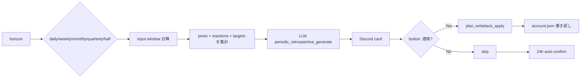
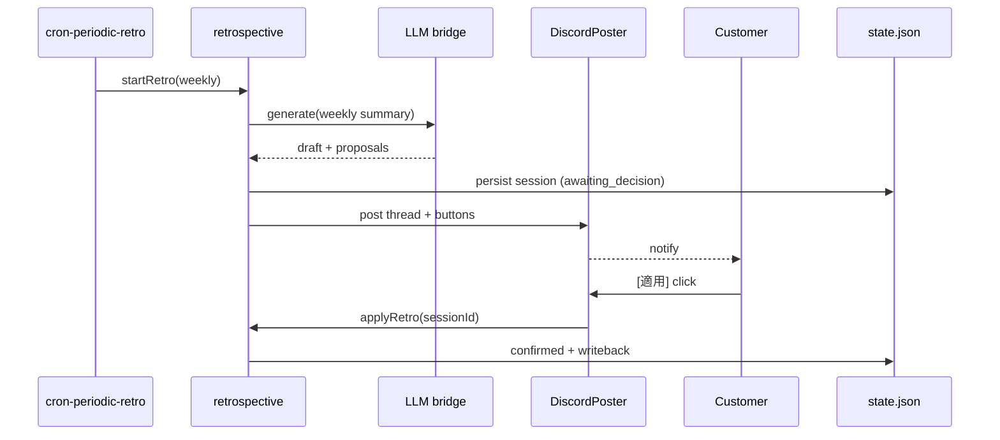

## Periodic retrospective & plan writeback

> **対象読者**: src/posting/retrospective.ts + account-state/plan-writeback.ts を直す developer
> **前提**: state machine、horizon の概念
> **読了時間**: 約 9 分

定期振り返り (daily/weekly/monthly/quarterly/half) と、振り返り結果を account.json に書き戻す writeback の 2 段階。

## 1. horizon-parameterized retrospective



| horizon     | 頻度           | 入力 window | writeback 対象        |
| ----------- | -------------- | ----------- | --------------------- |
| `daily`     | 毎日 19:00 JST | 当日        | (なし)                |
| `weekly`    | 月曜 07:00 JST | 当週 7 日   | (なし)                |
| `monthly`   | 月初 07:00 JST | 当月        | `active_window`       |
| `quarterly` | 四半期初       | 当四半期    | `goal_stack`, `brand` |
| `half`      | 半期初         | 当半期      | `half_focus`          |

`state.last_retrospective_at: { daily, weekly, monthly, quarterly, half }` で前回時刻を管理。次の発火タイミングを計算する。

cron timer 起動から writeback までの全体シーケンス:



## 2. retrospective の生成

```typescript
async function runRetrospective(
  horizon: Horizon,
  state: AccountState,
  bridge: LlmProvider,
  now: Date,
): Promise<Retrospective> {
  const window = computeWindow(horizon, now);
  const corpus = collectCorpus(state, window);
  const response = await bridge.call({
    kind: 'periodic_retrospective_generate',
    systemPrompt: RETROSPECTIVE_SYSTEM,
    userPrompt: buildRetrospectivePrompt(horizon, corpus),
  });
  return parseRetrospective(response.text);
}
```

corpus に入れるもの:

- 期間内の publish 済みポスト + engagement 数値
- reply / quote の応答結果
- target の活動 (任意)
- skip_dates の頻度
- 5-axis 平均 score の trend

## 3. retrospective card

Discord に送る card の構造:

```text
[QREV q2] 四半期 retrospective

期間: 2026-04-01 〜 2026-06-30
発射: 80 投稿 / engagement 平均 3.2k

keep:
- 副業実践者向けの語り口は反応良い
- 失敗談 hook は engagement +30%

change:
- 「収入自慢」に見えがちな数字 hook は避ける
- 「肩書きの外側」テーマを継続

writeback (適用すると account.json が更新されます):
- goal_stack: ["副業の継続", "肩書きの外側"]
- brand: voice="自分語り 60%, 質問投げかけ 40%"

[適用] [一部だけ適用] [ロールバック] [スキップ]
```

button or 自然文で進む。24h 放置で自動確定。

## 4. plan writeback

retrospective の結果を account.json に書き戻す。`src/account-state/plan-writeback.ts`。

```typescript
interface WritebackProposal {
  horizon: Horizon;
  fields: {
    active_window?: string;
    goal_stack?: string[];
    brand?: BrandConfig;
    half_focus?: string;
  };
  rationale: string;
}

async function applyWriteback(proposal: WritebackProposal, repo: AccountRepo): Promise<void> {
  await repo.updateAccount((account) => {
    const next = { ...account };
    if (proposal.fields.active_window) next.active_window = proposal.fields.active_window;
    if (proposal.fields.goal_stack) next.goal_stack = proposal.fields.goal_stack;
    if (proposal.fields.brand) next.brand = proposal.fields.brand;
    if (proposal.fields.half_focus) next.half_focus = proposal.fields.half_focus;
    return next;
  });
}
```

writeback は **immutable update** で行う。元の account.json は git に履歴が残るので rollback 可能。

## 5. rollback

「適用したけど違和感」と顧客が言ったら:

```typescript
async function rollbackWriteback(horizon: Horizon, repo: AccountRepo): Promise<void> {
  // state.plan_writeback_history から直前の値を読んで復元
  const history = state.plan_writeback_history;
  const last = history.find((h) => h.horizon === horizon);
  if (!last) throw new Error('no rollback target');
  await repo.updateAccount((account) => ({
    ...account,
    ...last.previous_values,
  }));
}
```

`state.plan_writeback_history` は最大 10 件 (古いものから drop)。

## 6. 一部だけ適用 (selective apply)

monthly retrospective で `active_window` だけ適用、`brand` は保留したい時:

```text
[一部だけ適用] を押す
  → bot: どのフィールドを適用しますか？
       [active_window のみ] [brand のみ] [両方適用]
```

state.plan_writeback_history には selective applied フラグが残る。

## 7. 24h auto-confirm

button を押されないまま 24h 経過 → 自動 apply。
ただし quarterly / half のような大きな writeback は **auto apply しない** (顧客に意識的に確定させたいため)。

```typescript
const AUTO_CONFIRM_HORIZONS: Horizon[] = ['daily', 'weekly'];

if (now - card.created_at > 24h && AUTO_CONFIRM_HORIZONS.includes(card.horizon)) {
  await autoApply(card);
}
```

monthly / quarterly / half は auto apply しないが、24h で「reminder」を 1 回送る。

## 8. retrospective の triggering

`mex-weekly-retro-<id>.timer` などの timer が developing horizon を判定して発火。

```typescript
function shouldRunRetrospective(horizon: Horizon, lastAt: Date | null, now: Date): boolean {
  if (!lastAt) return true; // 初回
  switch (horizon) {
    case 'daily':
      return !sameDay(lastAt, now);
    case 'weekly':
      return now.getDay() === 1 && !sameWeek(lastAt, now); // Monday
    case 'monthly':
      return now.getDate() === 1 && !sameMonth(lastAt, now);
    case 'quarterly':
      return (
        [1, 4, 7, 10].includes(now.getMonth() + 1) &&
        now.getDate() === 1 &&
        !sameQuarter(lastAt, now)
      );
    case 'half':
      return [1, 7].includes(now.getMonth() + 1) && now.getDate() === 1 && !sameHalf(lastAt, now);
  }
}
```

## 9. テスト

```typescript
test('weekly retro fires only on Monday', () => {
  expect(shouldRunRetrospective('weekly', lastMonday, thisTuesday)).toBe(false);
  expect(shouldRunRetrospective('weekly', lastMonday, nextMonday)).toBe(true);
});

test('writeback updates active_window', async () => {
  const proposal = { horizon: 'monthly', fields: { active_window: '副業継続 + 肩書きの外側' } };
  await applyWriteback(proposal, repo);
  const account = await repo.readAccount();
  expect(account.active_window).toBe('副業継続 + 肩書きの外側');
});

test('rollback restores previous active_window', async () => {
  // setup: previous = "A", apply "B"
  await applyWriteback({ horizon: 'monthly', fields: { active_window: 'B' } }, repo);
  await rollbackWriteback('monthly', repo);
  expect((await repo.readAccount()).active_window).toBe('A');
});
```

## 10. 関連 docs

- [20-posting-state-machine.md](./20-posting-state-machine.md)
- [40-storage-and-migration.md](./40-storage-and-migration.md)
- [12-llm-bridge.md](./12-llm-bridge.md)
