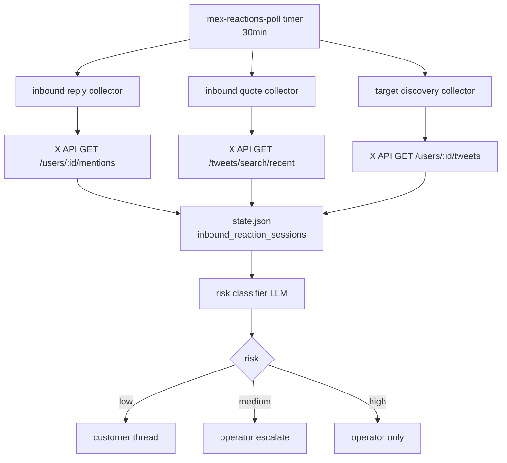
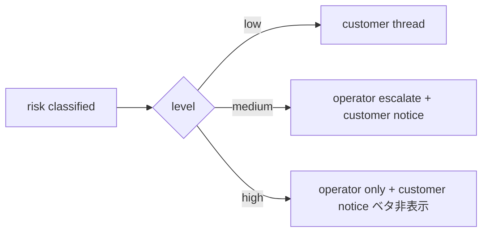

## X API collectors

> **対象読者**: src/x-api/ を直す developer
> **前提**: twitter-api-v2 SDK の基礎、X API v2 の rate limit
> **読了時間**: 約 8 分

inbound reply / quote / target discovery を担当する poll module 群。

## 1. 全体図



## 2. rate limit 管理

X Basic tier の月間制限:

| endpoint | 月間 |
| --- | --- |
| GET /users/:id/mentions | 10,000 / month |
| GET /tweets/search/recent | 10,000 / month |
| GET /users/:id/tweets | 10,000 / month |
| POST /tweets | 3,000 / month |

`src/x-api/poll-state.ts` で API ごとの reset 時刻 + 残数を `state.x_api_rate_limit` に記録。

```typescript
interface RateLimitState {
  endpoint: string;
  limit_per_month: number;
  used_this_month: number;
  reset_at: string;     // window reset (X API ヘッダから)
  last_429_at?: string;
}
```

429 を受けたら次の reset まで poll を skip。

## 3. inbound reply collector

`src/x-api/inbound-reply.ts` (実装例):

```typescript
async function collectInboundReplies(
  client: TwitterApi,
  state: AccountState,
  now: Date,
): Promise<InboundReply[]> {
  const since = state.last_reply_poll_at ?? subHours(now, 1);
  const userId = state.x_user_id;

  const result = await client.v2.userMentionTimeline(userId, {
    start_time: since.toISOString(),
    'tweet.fields': ['author_id', 'created_at', 'in_reply_to_user_id', 'referenced_tweets'],
    expansions: ['author_id'],
    'user.fields': ['username', 'name', 'verified', 'public_metrics'],
    max_results: 100,
  });

  return result.tweets.map(toInboundReply);
}
```

新規 reply は `state.inbound_reaction_sessions` に append。重複は `tweet_id` で de-dup。

## 4. inbound quote collector

引用は別 endpoint で取得する。検索 query を `url:"twitter.com/<username>"` で構築:

```typescript
async function collectInboundQuotes(
  client: TwitterApi,
  state: AccountState,
  now: Date,
): Promise<InboundQuote[]> {
  const username = state.x_username;
  const since = state.last_quote_poll_at ?? subHours(now, 1);

  const query = `url:"twitter.com/${username}/status" -is:retweet -from:${username}`;
  const result = await client.v2.search(query, {
    start_time: since.toISOString(),
    'tweet.fields': ['author_id', 'created_at', 'referenced_tweets', 'public_metrics'],
    expansions: ['author_id', 'referenced_tweets.id'],
    max_results: 50,
  });

  return result.tweets
    .filter(t => isQuoteOf(t, state.x_user_id))
    .map(toInboundQuote);
}
```

`isQuoteOf` で `referenced_tweets[?type==quoted].id` が自分の tweet かを確認。

## 5. target discovery collector

target list の各 user の最近投稿を取得し、hot な topic / 反応傾向を集計:

```typescript
async function collectTargetActivity(
  client: TwitterApi,
  state: AccountState,
  now: Date,
): Promise<TargetActivity[]> {
  const targets = state.targets;
  const out: TargetActivity[] = [];
  for (const target of targets) {
    if (rateLimitNearExhaustion(state)) break;
    const tweets = await client.v2.userTimeline(target.user_id, {
      start_time: subDays(now, 7).toISOString(),
      max_results: 20,
    });
    out.push(summarize(target, tweets));
  }
  return out;
}
```

target 数が多いと quota 圧迫するので、operator は 5-10 名に絞る ([../operator/13-x-api-setup.md](../operator/13-x-api-setup.md))。

## 6. risk classify

inbound reply / quote の **本文を LLM で分類** し risk level を決める。

```typescript
const result = await bridge.call({
  kind: 'inbound_risk_classify',
  systemPrompt: INBOUND_RISK_SYSTEM,
  userPrompt: buildRiskPrompt(reply.text, reply.author, recentContext),
});
const parsed = parseJson(result.text);
// { risk: 'low' | 'medium' | 'high', reason: '...' }
```

prompt の核:

```text
あなたは X 反応の risk classifier。次の reply を分類してください。

low_risk: 賞賛 / 同意 / 軽い質問
medium_risk: 反論 / 不満 / 個人情報を含む
high_risk: 攻撃 / 法的リスク / なりすまし疑い

JSON で {"risk": "...", "reason": "..."}
```

## 7. routing



- low: thread + 下書き reply 添付
- medium: operator escalate + 顧客に "1 件 escalate しました"
- high: operator のみ、顧客 notice では本文非表示

実装は `src/x-api/inbound-router.ts` などに集約。

## 8. inbound_reply_draft

low_risk の reply に対して下書き応答を LLM 生成:

```typescript
const draft = await bridge.call({
  kind: 'inbound_reply_draft',
  systemPrompt: REPLY_DRAFT_SYSTEM,  // persona + brand を含む
  userPrompt: buildReplyPrompt(originalPost, replyText, replyAuthor),
});
```

claude-code provider で context の余裕を取る (persona + 元投稿 + reply + ガイドラインを全部入れる)。

## 9. dedup of inbound

同じ reply を 2 回扱わないように `state.inbound_reaction_sessions` の `tweet_id` 集合で de-dup。

```typescript
const known = new Set(state.inbound_reaction_sessions.map(s => s.source_tweet_id));
const newOnes = collected.filter(r => !known.has(r.tweet_id));
```

## 10. テスト

twitter-api-v2 を mock:

```typescript
const fakeClient = {
  v2: {
    userMentionTimeline: vi.fn().mockResolvedValue({
      tweets: [makeTweet({ id: '123', text: 'great post' })],
    }),
  },
} as unknown as TwitterApi;

const replies = await collectInboundReplies(fakeClient, state, now);
expect(replies).toHaveLength(1);
```

## 11. 関連 docs

- [00-architecture.md](./00-architecture.md)
- [12-llm-bridge.md](./12-llm-bridge.md)
- [../operator/13-x-api-setup.md](../operator/13-x-api-setup.md)
- [../operator/21-monitoring.md](../operator/21-monitoring.md)
