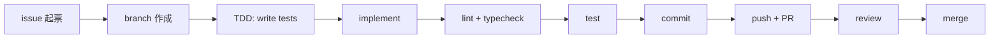

## Contributing

> **対象読者**: mex-next に PR を投げる developer
> **前提**: TypeScript / Git の基礎
> **読了時間**: 約 6 分

development workflow と PR rule。

## 1. 開発フロー



## 2. local 起動

```bash
git clone https://github.com/zumizumi-3/mex-next
cd mex-next
npm install
cp .env.example .env  # 必要な値を埋める
doppler login         # local dev 用
npm run dev           # tsx で hot reload
```

## 3. branch / commit

### 3.1 branch 名

`<type>-<short-desc>` または `<area>/<short-desc>`:

```text
feat-quote-collector
fix-intent-router-fallback
refactor-state-machine
docs-customer-onboarding
```

### 3.2 commit message

Conventional Commits ベース:

```text
<type>: <subject>

<optional body>
```

`type`: `feat`, `fix`, `refactor`, `docs`, `test`, `chore`, `perf`, `ci`

### 3.3 例

```text
feat: add quote-v2 collector with risk classify

X API search で自分宛の quote を 30min poll で収集する。
inbound_reaction_sessions に追加し、risk classifier で振り分ける。
```

## 4. lint / typecheck / test

PR を出す前に必ず通す:

```bash
npm run typecheck
npm run lint
npm test
npm run test:coverage  # 80% 以上維持
```

CI 上でも回るが、local で先に通すこと。

## 5. PR rule

### 5.1 PR title

短く (70 文字以下)。詳細は body へ:

```text
feat: quote-v2 collector + risk classify
```

### 5.2 PR body template

```markdown
## Summary
- 何を変えたか (1-3 bullet)

## Why
- なぜ必要か

## Test Plan
- [ ] unit test 追加 (xxx.test.ts)
- [ ] coverage 80%+
- [ ] integration test (将来)
- [ ] 手元で `npm run dev` で動作確認

## Screenshots / Logs
(必要に応じて)
```

### 5.3 review 観点

- 設計 (DESIGN.md と矛盾しないか)
- immutability (mutation してないか)
- error handling (silent fail 無いか)
- test coverage
- log 充実 (operator が困らないか)

## 6. 大きい変更 (planner agent 推奨)

> 200 行以上の追加 / 複数 module にまたがる変更は **planner agent** で plan 起こしてから実装するのを推奨。

```text
1. issue で要件整理
2. planner で plan.md 起こし
3. user に plan を見せて合意
4. TDD で実装
```

## 7. file 分割の目安

- 1 ファイル 200-400 行が目処
- 800 行超えたら split
- 1 module = 1 責務 (high cohesion)
- module 間は interface で疎結合

## 8. immutability 強制

```typescript
// WRONG
state.publish_queue.push(item);

// CORRECT
return { ...state, publish_queue: [...state.publish_queue, item] };
```

`Readonly<T>` を関数引数で意識的に付ける:

```typescript
function transitionTo(session: Readonly<PostingSession>, to: PostingState): PostingSession {
  // session を mutate しようとすると tsc がエラー
  return { ...session, state: to };
}
```

## 9. 依存追加

新しい dep を入れる前に:

- 本当に必要か (10 行で書ける util を入れない)
- license 確認 (MIT / Apache が望ましい)
- maintenance status (last commit < 1 year)
- bundle size (ESM対応か)

NPM へ追加:

```bash
npm install <pkg>
# package.json + package-lock.json をコミット
```

## 10. 機密情報

- secrets を **絶対に commit しない** (Doppler で管理)
- log にも token / key を出さない (`sk-***xxxx` のような頭尾だけにする)
- test でも実 token は使わない (fake-...)

## 11. self-review checklist

PR 出す前に:

- [ ] 変更が自分の責任範囲か (設計逸脱していないか)
- [ ] test 追加した
- [ ] coverage 80%+
- [ ] log 追加 (新しい kind の処理に observability)
- [ ] docs 更新 (公開 API 変更時)
- [ ] DESIGN.md / 関連 developer doc を読み直した
- [ ] commit message が conventional に従っている
- [ ] secrets / token を漏らしていない

## 12. 関連 docs

- [00-architecture.md](./00-architecture.md)
- [50-testing.md](./50-testing.md)
- [90-glossary.md](./90-glossary.md)
