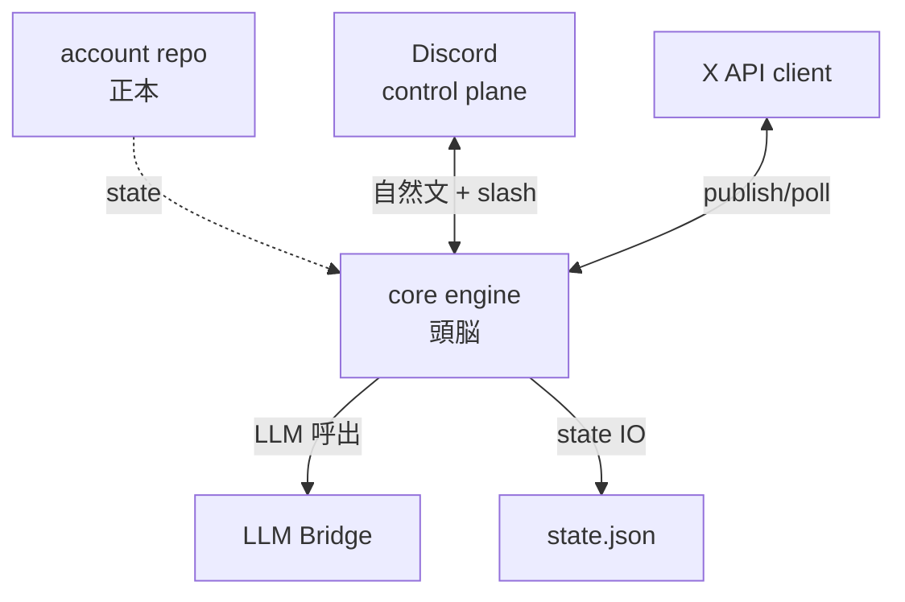
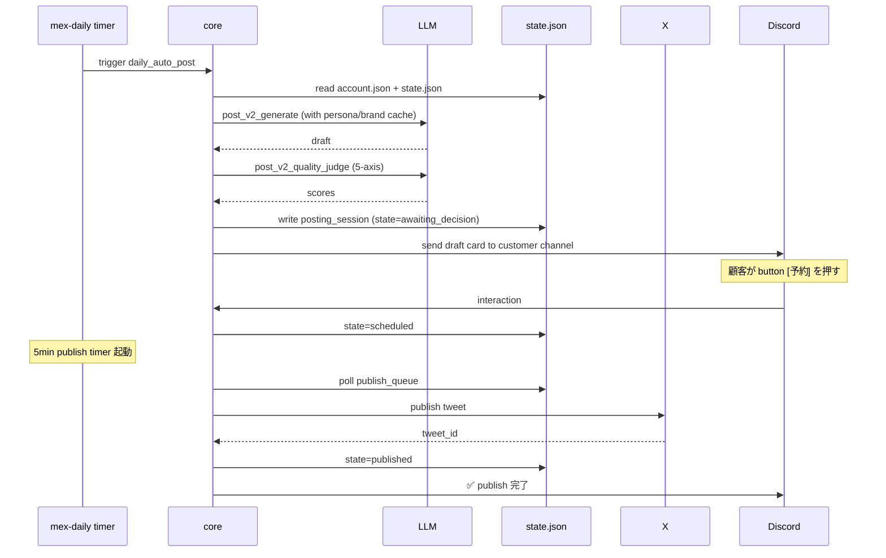

## MeX Next の全体像

> **対象読者**: operator (運用者)
> **前提**: 何らかの SaaS / X 自動投稿運用経験
> **読了時間**: 約 10 分

MeX Next は **X (Twitter) アカウントの運用 OS** です。投稿生成機ではなく、1 日のリズムでアカウントを回し続けるための分散システムです。

## 1. 設計の核



### 4 つの不変方針

1. **repo が正本** ─ `account.json` / `state.json` のみが真実
2. **core が頭脳** ─ LLM 呼出はすべて bridge 経由で集約
3. **Discord は control plane** ─ 顧客の唯一の窓
4. **1 顧客 = 1 VPS = 1 Discord bot** ─ multi-tenant にしない

### 顧客が触る面

- Discord 1 つだけ
- 自然文 primary、slash secondary
- VPS / Doppler / GitHub / X Developer Portal は触らない

operator が事前に全部用意します。

## 2. Python 版との違い

| 項目 | Python (`zumizumi-3/mex`) | Node.js (`mex-next`) |
| --- | --- | --- |
| 言語 | Python 3.11 | TypeScript 5 + Node.js 20 |
| Discord SDK | discord.py | discord.js v14 |
| LLM | anthropic Python SDK + claude-code CLI | anthropic TS SDK + claude-code CLI |
| HTTP | aiohttp | undici (built-in) |
| データ I/O | pydantic schema migration | zod schema |
| 行数 | 50K+ | 8-10K (目標) |
| Discord 対話 | discord.py で詰まる UX | wah-office-v2 から移植したエンジン |
| 状態 IO | atomic write + flock (自前) | atomic write + flock (proper-lockfile) |
| Provider 切替 | claude-code CLI 必須箇所多 | LLM Bridge 経由で SDK / CLI を kind ごとに選択 |

業務ロジック (Posting v2 状態機械、5-axis judge、horizon retrospective、plan writeback) は **言語に依存しないので忠実移植**。

### Python から捨てたもの

- 旧 GIDS 系 / accounts-registry ベースの multi-tenant 1 bot
- discord.py の独自 hack (interaction defer の二重送信回避とか)
- pydantic v1 互換のための schema migration

### Python から保持したもの

- account.json / state.json schema (zod で 1:1 移植)
- migrate-from-python.ts で互換読み込み
- LLM kind 名 (snake_case を維持)
- channel role 名 (snake_case を維持)

詳細は [30-migration-from-python.md](./30-migration-from-python.md) を参照。

## 3. module 構成

```text
src/
├── main.ts                  # bot entry, signal handling
├── config.ts                # env / Doppler / argv
├── account-state/           # repo I/O, zod schema, migration
├── automation/              # preflight, escalation
├── conversation/            # turn-orchestrator, intent-router, locks, sessions
├── discord/                 # message-handler, interactions, approvals, threads
├── llm/                     # bridge (anthropic + claude-code), prompts, kinds
├── observability/           # structured logger
├── posting/                 # state-machine, scheduler, dedup, retrospective, edit-diff
├── settings/                # cadence, skip
├── x-api/                   # twitter-api-v2 wrapper, poll-state
└── utils/                   # jst time helpers
```

各 module は 200-400 行を目処、800 行を超えたら split。tests/ は src と並行構造。

## 4. データの流れ (1 投稿の vertical slice)



## 5. operator が触るもの

| ツール | 用途 |
| --- | --- |
| Doppler CLI | secrets 管理 (X API key, Anthropic key, Discord bot token) |
| systemctl | bot / timer の起動・停止 |
| journalctl | log tail |
| gh CLI | account repo の管理 |
| Discord Developer Portal | bot 作成、token reset |
| X Developer Portal | API key 発行 |

詳細は [10-install.md](./10-install.md) 以降。

## 6. account 数のスケール

1 VPS = 1 account が原則。同じ VPS に複数 account を載せるのは operator 自身など限定的な場合のみ。

理由:
- token / quota の独立性
- crash の影響範囲を 1 顧客に閉じる
- migration 時の cut-over 単純化

詳細: [40-multi-account.md](./40-multi-account.md)

## 7. 関連 docs

- [10-install.md](./10-install.md) — install.sh / bootstrap.sh
- [11-discord-setup.md](./11-discord-setup.md) — Discord Application
- [12-doppler-setup.md](./12-doppler-setup.md) — secrets 管理
- [13-x-api-setup.md](./13-x-api-setup.md) — X Developer Portal
- [20-runbook.md](./20-runbook.md) — 日常運用
- [21-monitoring.md](./21-monitoring.md) — 監視
- [30-migration-from-python.md](./30-migration-from-python.md) — Python からの移行
- [50-troubleshooting.md](./50-troubleshooting.md) — common issues

開発者向けは [../developer/](../developer/) を参照。
