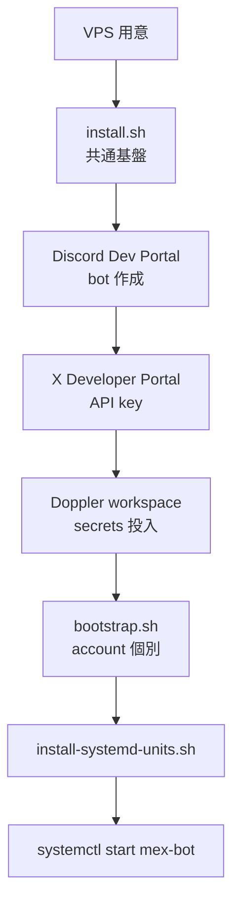
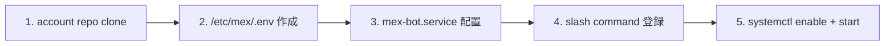

## install / bootstrap 手順

> **対象読者**: 新しい VPS に MeX Next を立てる operator
> **前提**: Ubuntu 22.04 LTS / Debian 12 系の VPS、root 権限あり
> **読了時間**: 約 15 分

VPS 1 台に対して **1 account** を載せる前提です。複数 account を 1 VPS に同居させたい場合は [31-multi-account.md](./31-multi-account.md) を参照。

## 1. 全体フロー



各ステップ:

| step | 概要 | 所要時間 |
| --- | --- | --- |
| install.sh | Node 20 + Doppler CLI + gh CLI + Claude Code | 5-10 分 |
| Discord Dev Portal | bot 作成 + Privileged Intents | 5 分 ([11-discord-setup.md](./11-discord-setup.md)) |
| X Developer Portal | API tier 申請 + key 発行 | 5-30 分 ([13-x-api-setup.md](./13-x-api-setup.md)) |
| Doppler | project / config / token | 5 分 ([12-doppler-setup.md](./12-doppler-setup.md)) |
| bootstrap.sh | account repo clone + bot service | 5 分 |
| install-systemd-units.sh | account suffix 付き timer/service 配置 | 1 分 |

## 2. 事前準備チェックリスト

- [ ] VPS にログインできる
- [ ] sudo 権限がある
- [ ] Discord アカウント (operator 用)
- [ ] X (Twitter) アカウント (顧客用)
- [ ] LLM provider (Anthropic API key / Claude Code login / Codex login のいずれか)
- [ ] GitHub token (account repo を private で管理)

## 3. install.sh の使い方

共通基盤 (Node 20 / Doppler / gh / Claude Code) を入れます。

```bash
# VPS 上で root として
curl -fsSL https://raw.githubusercontent.com/zumizumi-3/mex-next/main/scripts/install.sh | bash
```

入るもの:

| tool | version | 用途 |
| --- | --- | --- |
| Node.js | 20 LTS | bot ランタイム |
| npm | latest | 依存管理 |
| Doppler CLI | latest | secrets fetch |
| gh CLI | latest | account repo 操作 |
| Claude Code | latest | claude-code provider |
| systemd | (default) | service 管理 |

完了後に `node --version` / `doppler --version` / `gh --version` / `claude --version` で確認。

## 4. Discord / X / Doppler の事前準備

このタイミングで Discord Dev Portal / X Developer Portal / Doppler workspace を作っておきます。詳細は各ページに分けています。

- [11-discord-setup.md](./11-discord-setup.md)
- [13-x-api-setup.md](./13-x-api-setup.md)
- [12-doppler-setup.md](./12-doppler-setup.md)

ここまでで準備するもの:

```text
DISCORD_BOT_TOKEN          (Discord Application bot token)
DISCORD_APPLICATION_ID     (slash command 登録用)
DISCORD_GUILD_ID           (顧客の Discord server ID)
ANTHROPIC_API_KEY          (任意。無い場合は Claude Code / Codex CLI provider を使う)
X_API_CONSUMER_KEY         (X Developer Portal、tier=Basic 推奨)
X_API_CONSUMER_SECRET
X_API_ACCESS_TOKEN         (顧客の OAuth1.0a token)
X_API_ACCESS_TOKEN_SECRET
GITHUB_TOKEN               (account repo 管理用 PAT)
```

これらは **Doppler に投入** し、VPS には DOPPLER_TOKEN だけ置きます。

## 5. bootstrap.sh の使い方

account 個別の整備をします。

```bash
sudo /opt/mex-next/scripts/bootstrap.sh \
  --account-id zumi-x \
  --doppler-token dp.st.prd.xxxxx \
  --account-repo-url https://github.com/<owner>/<account>-x-ops \
  --customer-discord-user-id 123456789012345678 \
  --operator-discord-user-id 234567890123456789
```

引数:

| flag | 例 | 意味 |
| --- | --- | --- |
| `--account-id` | zumi-x | kebab-case の識別子 |
| `--doppler-token` | dp.st.prd.xxxx | service token (read-only) |
| `--account-repo-url` | https://github.com/.../-x-ops | GitHub の private repo URL |
| `--customer-discord-user-id` | 数字 18-19 桁 | 顧客の Discord user ID |
| `--operator-discord-user-id` | 数字 18-19 桁 | operator の ID (escalate 先) |

bootstrap.sh がやること:



配置先:

```text
/srv/mex/<account-id>-x-ops      # account repo (chown: mex)
/etc/mex/<account-id>.env        # DOPPLER_TOKEN / ACCOUNT_ID / ACCOUNT_REPO
/etc/systemd/system/mex-bot.service             # Discord bot
```

## 6. timer/service unit の配置

timer で起動する one-shot service は `mex-{name}-{ACCOUNT_ID}.service`、対応 timer は `mex-{name}-{ACCOUNT_ID}.timer` に統一。legacy の suffix なし unit は `install-systemd-units.sh` が disable/remove します。

```bash
cd /opt/mex-next
sudo bash scripts/install-systemd-units.sh zumi-x
```

事前確認だけしたい場合:

```bash
bash scripts/install-systemd-units.sh zumi-x --dry-run
# or
MEX_SYSTEMD_DRY_RUN=1 ACCOUNT_ID=zumi-x bash scripts/install-systemd-units.sh
```

配置される 12 timer:

| timer | trigger |
| --- | --- |
| `mex-publish-<id>.timer` | 5 分ごと |
| `mex-daily-<id>.timer` | 毎日 07:00 JST |
| `mex-morning-digest-<id>.timer` | 毎日 07:00 JST |
| `mex-reactions-poll-<id>.timer` | 15 分ごと |
| `mex-self-check-<id>.timer` | 1 時間ごと |
| `mex-weekly-retro-<id>.timer` | 月曜 07:00 JST |
| `mex-phase-questionnaire-monthly-<id>.timer` | 毎月 1 日 09:00 JST |
| `mex-phase-questionnaire-weekly-<id>.timer` | 月曜 09:00 JST |
| `mex-proactive-nudge-weekly-<id>.timer` | 月曜 07:30 |
| `mex-proactive-nudge-monthly-<id>.timer` | 毎月 1 日 07:30 |
| `mex-proactive-nudge-stale-target-<id>.timer` | 毎日 08:00 |
| `mex-proactive-nudge-unanswered-phase-<id>.timer` | 毎日 19:00 |

## 7. 確認

```bash
# bot 起動確認
sudo systemctl status mex-bot
sudo journalctl -u mex-bot -n 50

# timer 起動確認
sudo systemctl list-timers 'mex-*-zumi-x.timer'

# Discord で bot のステータスが緑か
# 顧客 channel に「こんにちは。MeX bot です」が届くか
```

## 8. slash command 登録

bootstrap.sh 内で自動実行されますが、手動でも可能。

```bash
sudo -u mex node /opt/mex-next/dist/scripts/register-slash.js \
  --doppler-token dp.st.prd.xxxxx \
  --guild-id 1234567890
```

guild-scoped は反映が即時。global は 1 時間程度かかります。

## 9. preflight の扱い

`mex-self-check-<id>.timer` が 1 時間ごとに preflight を走らせます。`ANTHROPIC_API_KEY` は必須 gate ではなく、Claude Code / Codex CLI が使えれば pass。X API credential 不足は `warn` 扱いなので bot 起動は止めず、operator が Doppler / X Developer Portal を確認します。

```bash
sudo journalctl -u mex-self-check-zumi-x.service -n 80 --no-pager
```

## 10. 自動更新 (self-update)

`mex-self-update.timer` は account suffix なしの global timer。30 分間隔で `/opt/mex-next` を pull / build / restart する既存経路で、上の 12 個の per-account timer とは別枠です。operator 明示操作や `/mex update` からは `mex-self-update.service` を起動する。

## 11. 削除手順

account を畳む時:

```bash
sudo systemctl stop mex-bot 'mex-*-<id>.timer'
sudo systemctl disable mex-bot ...
sudo rm /etc/systemd/system/mex-bot.service \
        /etc/systemd/system/mex-*-<id>.service \
        /etc/systemd/system/mex-*-<id>.timer \
        ...
sudo rm -rf /srv/mex/<account-id>-x-ops
sudo rm /etc/mex/<account-id>.env
sudo systemctl daemon-reload
```

GitHub repo / Doppler project は別途手動で削除 (誤削除防止のため bootstrap.sh では消さない)。

## 12. 関連 docs

- [11-discord-setup.md](./11-discord-setup.md)
- [12-doppler-setup.md](./12-doppler-setup.md)
- [13-x-api-setup.md](./13-x-api-setup.md)
- [20-runbook.md](./20-runbook.md)
- [31-multi-account.md](./31-multi-account.md)
- [50-troubleshooting.md](./50-troubleshooting.md)
