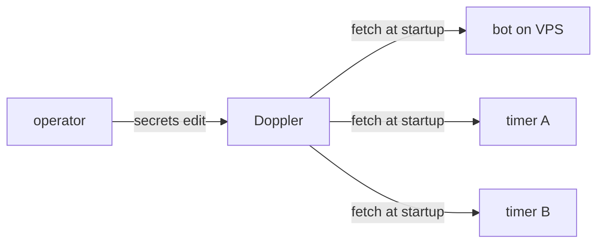

## Doppler project / config / service token

> **対象読者**: secrets を Doppler 一元管理する operator
> **前提**: Doppler アカウントを持っている
> **読了時間**: 約 7 分

すべての secrets (X API key / Anthropic key / Discord bot token / GitHub token) は **Doppler に集約** します。VPS の `.env` には DOPPLER_TOKEN だけ置きます。

## 1. なぜ Doppler か



- secrets 一元管理 (VPS / GitHub / 開発機で値がズレない)
- audit log (誰がいつ secret を変えたか)
- service token で read-only に絞れる
- rotation が 1 箇所
- `.env` ファイルに secrets を書き残さない

## 2. project の作成

Doppler dashboard → New Project:

- Name: `mex-<account-id>` (例: `mex-zumi-x`)
- Slug: project と同じ

### 2.1 config

各 project に config を作ります。

| config | 用途 |
| --- | --- |
| `dev` | 開発機での実験 |
| `stg` | (任意) ステージング |
| `prd` | 本番 VPS |

通常は `dev` と `prd` のみで十分。

## 3. secrets を投入

`prd` config に次を投入:

```text
DISCORD_BOT_TOKEN=MTAxOTU3...
ANTHROPIC_API_KEY=sk-ant-...
X_API_CONSUMER_KEY=...
X_API_CONSUMER_SECRET=...
X_API_ACCESS_TOKEN=...
X_API_ACCESS_TOKEN_SECRET=...
GITHUB_TOKEN=ghp_...
ACCOUNT_ID=zumi-x
DISCORD_APPLICATION_ID=...
DISCORD_GUILD_ID=...
OPERATOR_DISCORD_USER_IDS=123,456
```

非 secret な値 (ACCOUNT_ID / GUILD_ID 等) も Doppler に置くか `/etc/mex/<id>.env` に置くかは好み。Doppler 一元の方が「VPS 側で完全空」にできるので推奨。

## 4. service token の発行

VPS から read-only に取りに行くための token を発行します。

```text
Access tab → Service Tokens → Generate
  Config: prd
  Name: vps-<account-id>
  Access: Read
```

得られた `dp.st.prd.xxxxxxxxxxxxxxxxxx` を VPS の `/etc/mex/<id>.env` に書きます。

```bash
# /etc/mex/zumi-x.env
DOPPLER_TOKEN=dp.st.prd.xxxxxxxxxxxxxxxxxx
ACCOUNT_ID=zumi-x
ACCOUNT_REPO=/srv/mex/zumi-x-x-ops
```

## 5. fetch 動作

bot 起動時に `doppler run -- node dist/main.js` で環境変数として展開されます。

```bash
# systemd unit から呼ばれる
ExecStart=/usr/bin/doppler run --token-file /etc/mex/%i-token -- /usr/bin/node /opt/mex-next/dist/main.js
```

> `%i` は systemd template 変数 (account-id)。1 unit で複数 account を template 化していますが、原則 1 VPS 1 account なので使用は限定的。

## 6. rotation

token が漏れた時:

| 漏れたもの | rotation 手順 |
| --- | --- |
| Discord bot token | Discord Dev Portal で reset → Doppler 更新 → systemctl restart |
| X API access token | X Developer Portal で revoke → 再生成 → Doppler 更新 |
| Anthropic key | Anthropic console で delete → 新 key 発行 → Doppler 更新 |
| GitHub PAT | github.com/settings/tokens で revoke → 新 PAT → Doppler 更新 |
| Doppler service token | Doppler で revoke → 新 service token 発行 → /etc/mex/<id>.env 書き換え |

更新後の確認:

```bash
sudo systemctl restart mex-bot
sudo journalctl -u mex-bot -f
# 「Doppler secrets loaded: N keys」のような log が出れば成功
```

## 7. local 開発

開発機で動かす時:

```bash
doppler login
doppler setup --project mex-zumi-x --config dev
doppler run -- npm run dev
```

dev config に開発用の secrets (sandbox bot token / sandbox account など) を入れておくと安全。

## 8. backup

Doppler は Snapshot 機能あり (paid plan)。free plan の場合は手動で:

```bash
doppler secrets download --project mex-zumi-x --config prd --format json > backup.json
# ※ backup.json に secrets が平文で出るので即削除 / KMS に上げる等
```

## 9. multi-account の例

複数 account を operator 1 人で運用する場合:

```text
Workspace: zumi-ops
├── Project: mex-zumi-x       (顧客 1)
├── Project: mex-tanaka-x     (顧客 2)
├── Project: mex-yamada-x     (顧客 3)
└── Project: mex-shared       (operator 共通: GITHUB_TOKEN 等)
```

各 VPS は自分の project の service token だけ持つ。混線リスク回避。

## 10. 関連 docs

- [10-install.md](./10-install.md)
- [11-discord-setup.md](./11-discord-setup.md)
- [13-x-api-setup.md](./13-x-api-setup.md)
- [50-troubleshooting.md](./50-troubleshooting.md)
