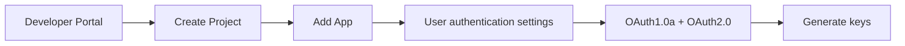
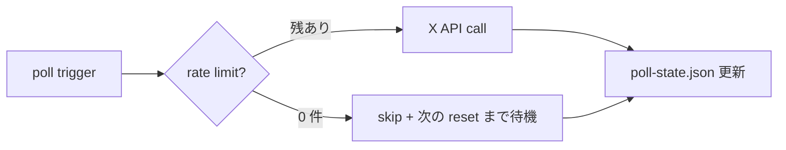

## X Developer Portal / API tier 選び方

> **対象読者**: 顧客向けに X API key を発行する operator
> **前提**: 顧客の X アカウントへのアクセス手段あり (顧客が手元で OAuth する想定)
> **読了時間**: 約 8 分

X (Twitter) API v2 の access token を発行し、Doppler に投入するまでを扱います。tier 選定が一番悩むので、まずそこから。

## 1. tier 選び方

| tier | 月額 | tweet POST | tweet GET | 推奨度 |
| --- | --- | --- | --- | --- |
| Free | $0 | 1,500/month | 100/month | × 圧倒的に足りない |
| Basic | $100/month | 3,000/month | 10,000/month | ◎ 標準 |
| Pro | $5,000/month | 1M+/month | 1M+/month | △ aggressive cadence なら |
| Enterprise | 別見積 | 制限なし | 制限なし | × 不要 |

### 必要量の見積もり

```text
1 アカウント / 1 日:
  POST: cadence×1 (light=1, standard=3, aggressive=5) + reply 1-3 = 2-8 回/日
  GET:  poll 30min (mentions/replies/quotes) = 48 回/日 + target 5 名 × 48 = 240 + reactions = 300/日

月換算:
  POST: 60-240/month
  GET:  9,000-15,000/month  ← Basic で足りる
```

**結論: Basic tier ($100/month) を推奨**。Free は POST はギリギリ、GET が完全に足りない。

> Basic tier の 10,000 GET/month を超える場合、target を 5 → 3 に減らすか、poll 間隔を 30min → 60min に延ばすかで調整します。詳細は [21-monitoring.md](./21-monitoring.md)。

## 2. Project / App 作成

https://developer.x.com にアクセス。



### 2.1 Project

- Name: `mex-<account-id>`
- Use case: "Building tools for myself / my customer"
- Description: 「Account operations OS that posts on behalf of the customer with their explicit consent」

### 2.2 App

Project 内で **Add App**:

- App name: `mex-<account-id>` (Project と同名で OK)
- Environment: `Production`

### 2.3 User authentication settings (重要)

- App permissions: **Read and write** (DM の権限は不要)
- Type of App: **Web App, Automated App or Bot**
- Callback URL: `http://localhost/callback` (token 取得スクリプト用、後で消してもよい)
- Website URL: 顧客サイト or 何か

### 2.4 OAuth flow

- OAuth 1.0a: ON
- OAuth 2.0: ON (任意 — v2 endpoint で必要なものに対応)

## 3. Consumer Key / Secret 取得

App の Keys and tokens タブから:

```text
X_API_CONSUMER_KEY=...
X_API_CONSUMER_SECRET=...
```

これは **App 単位** の key で、顧客が誰であれ同じです。

## 4. Access Token / Secret 取得 (顧客の認証)

bot は顧客のアカウントとして投稿するので、顧客の access token が必要です。

### 4.1 簡単な方法 (顧客が自分の token を発行)

App に **顧客が自分でログインして** Generate "Access Token and Secret" すれば、自分のアカウント用 token が発行されます。

- App の Keys タブ → Access Token and Secret → **Generate**
- 出てきた token を Doppler に投入

```text
X_API_ACCESS_TOKEN=...
X_API_ACCESS_TOKEN_SECRET=...
```

> この方法だと operator が顧客の X password を知る必要がない代わりに、顧客が Developer Portal にログインする必要がある。

### 4.2 OAuth 1.0a flow (より丁寧)

operator が小さなスクリプトを作って顧客に URL を踏んでもらう:

```bash
# scripts/oauth-helper.ts (実装あり)
node dist/scripts/oauth-helper.js \
  --consumer-key $X_API_CONSUMER_KEY \
  --consumer-secret $X_API_CONSUMER_SECRET
# → 表示される URL を顧客に踏ませる
# → 顧客が PIN を operator に教える
# → access token / secret が出力される
```

production では .1 (顧客が自分で発行) の方が単純で運用しやすい。

## 5. Doppler 投入

```text
X_API_CONSUMER_KEY=...
X_API_CONSUMER_SECRET=...
X_API_ACCESS_TOKEN=...
X_API_ACCESS_TOKEN_SECRET=...
```

詳細は [12-doppler-setup.md](./12-doppler-setup.md)。

## 6. rate limit の挙動

`twitter-api-v2` が自動で rate limit を尊重しますが、bot 側でも `src/x-api/poll-state.ts` で記録しています。



reset 時刻は `state.json` の `x_api_rate_limit` に記録されます。

## 7. Read 系 endpoint の使い分け

| endpoint | 用途 | 頻度 |
| --- | --- | --- |
| GET /users/by/username | target の解決 | 1 回 / target 追加時 |
| GET /users/:id/tweets | target の最近投稿 | 30min × target 数 |
| GET /users/:id/mentions | 自分宛 mention 取得 | 30min |
| GET /tweets/search/recent | quote 検索 | 30min |
| POST /tweets | 投稿 | publish 時 |

詳細: [../developer/30-x-api-collectors.md](../developer/30-x-api-collectors.md)

## 8. tier upgrade の判断

monitoring で次の値が連続 3 日 80% を超えたら Pro 検討:

- POST 月間使用率 > 80%
- GET 月間使用率 > 80%

通常 1 アカウントなら Basic で 1 年運用しても 30-50% 程度です。

## 9. tier downgrade

Free に下げるのは現実的でない (POST は何とかなるが GET が窮屈)。

## 10. 関連 docs

- [10-install.md](./10-install.md)
- [12-doppler-setup.md](./12-doppler-setup.md)
- [21-monitoring.md](./21-monitoring.md)
- [../developer/30-x-api-collectors.md](../developer/30-x-api-collectors.md)
