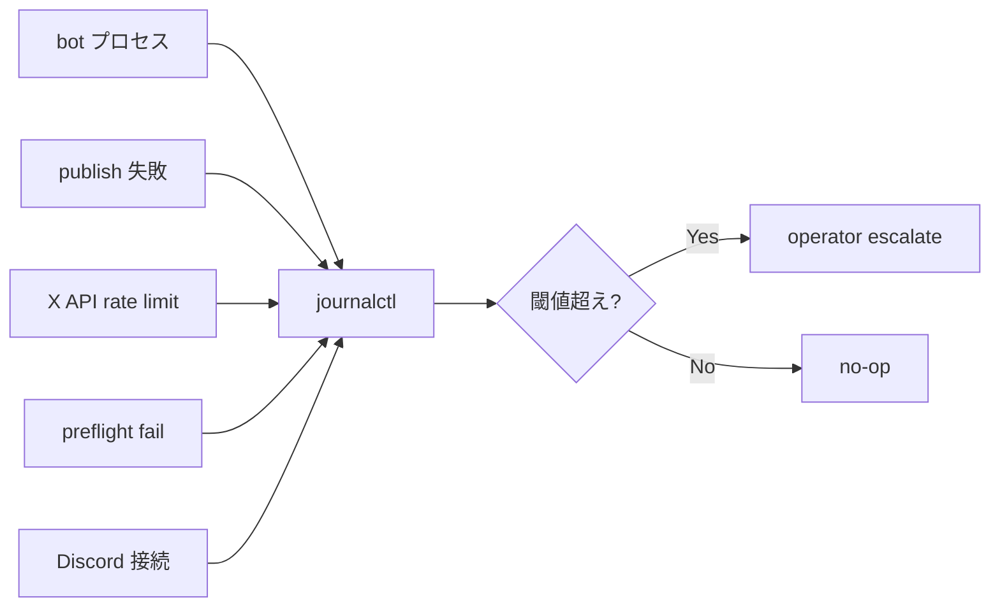

## 監視 — 何を見るか

> **対象読者**: operator
> **前提**: 日常運用が回っている
> **読了時間**: 約 7 分

bot の健全性を把握するために見るべき値と、その閾値です。

## 1. 監視対象まとめ



## 2. preflight (10 hard gate)

bot 起動時 / daily auto post 前に preflight が走ります。失敗したら operator escalate されます。

10 個の hard gate:

| gate | チェック内容 | 失敗時の症状 |
| --- | --- | --- |
| 1 | account.json 読込 | bot 全機能停止 |
| 2 | state.json 読込 + schema migration | 新規 account 扱い |
| 3 | DOPPLER_TOKEN 有効 | secrets 取得不可 |
| 4 | DISCORD_BOT_TOKEN | gateway 接続不可 |
| 5 | ANTHROPIC_API_KEY | LLM 呼出全滅 |
| 6 | X_API_* set | publish/poll 不可 |
| 7 | account repo writable | state 永続不可 |
| 8 | customer channel resolvable | draft 通知届かず |
| 9 | operator channel resolvable | escalate 不能 |
| 10 | persona/brand 初期化済 | LLM prompt 構築失敗 |

詳細は [../developer/40-storage-and-migration.md](../developer/40-storage-and-migration.md) と `src/automation/preflight.ts`。

## 3. publish 失敗

`publish_queue` の item が `failed_terminal` になった時。escalate のタイミング:

- 1 回目失敗 → `failed (retry)` で記録、operator には通知しない
- 2 回目失敗 → `failed (retry)` で再試行
- 3 回目失敗 → `failed_terminal` + operator escalate

```text
🚨 [ALERT] publish failed (3 attempts)
  account: zumi-x
  publish_id: pub-3a91
  reason: rate_limited (X API 429)
  next_action: wait until reset @ 14:00 JST
  log: journalctl -u mex-bot --since "1 hour ago"
```

## 4. X API rate limit

`state.x_api_rate_limit` を見ます。

| 指標 | 閾値 (warning) | 閾値 (critical) |
| --- | --- | --- |
| POST 月間使用率 | 60% | 80% |
| GET 月間使用率 | 60% | 80% |
| POST 連続 429 | 3 回 | 10 回 |

警告時の対応:

- target を 5 → 3 に減らす
- poll 間隔を 30min → 60min に延ばす ([../developer/30-x-api-collectors.md](../developer/30-x-api-collectors.md))

critical 時:

- tier upgrade (Basic → Pro) 検討
- ただし $5,000/month なので、まず使い方を見直す

## 5. Discord 接続

bot が gateway disconnect した場合:

```text
[error] Discord WebSocket closed (code=1006)
[info] reconnecting in 5s...
```

discord.js v14 が自動で再接続します。30 秒以上 connect できなければ alert log:

```text
🚨 [ALERT] discord_disconnected
  duration: 60s
  attempts: 12
  next_retry: 5s
```

対応:

- DISCORD_BOT_TOKEN が有効か (rotation 漏れ?)
- Discord の status page (https://discordstatus.com) を確認
- bot に Privileged Intents が ON か (token reset 後にリセットされてないか)

## 6. session TTL

posting session は 24h で `expired` 状態になります。`expired` が連続 3 件以上出るのは異常 (顧客が反応していない or bot から通知が届いていない)。

```bash
sudo -u mex node /opt/mex-next/dist/scripts/status.js \
  --account-repo /srv/mex/zumi-x-x-ops --json | \
  jq '.posting_sessions | map(select(.state == "expired")) | length'
```

## 7. memory / CPU

```bash
ps aux | grep "node.*mex-next" | awk '{print $2, $3, $4, $11}'
# pid, cpu%, mem%, command
```

正常値: 平均 CPU 1-3%, RAM 200-500MB。500MB 超えが続くなら memory leak 疑い。

## 8. disk

```bash
du -sh /srv/mex/zumi-x-x-ops/{content,state.json,account.json}
```

`content/` は publish 済み投稿の draft / final が累積するので 1 年で 100MB 程度。閾値 1GB で archive 検討。

## 9. log retention

journalctl の保持期間は systemd デフォルトで 4 週間。長期保管したい場合:

```bash
# /etc/systemd/journald.conf
SystemMaxUse=2G
MaxRetentionSec=12week
```

`SystemMaxUse` を上げないと過去ログが流れます。

## 10. 監視ツール (任意)

operator が複数 account を持つなら外部 monitoring を検討:

| tool | 用途 |
| --- | --- |
| Uptime Kuma | bot プロセス生存 |
| Healthchecks.io | timer 実行成功 ping |
| Grafana Loki | journalctl 集約 |
| pm2 (instead of systemd) | 別 process manager だが systemd 推奨 |

最小構成は systemd + journalctl で十分です。

## 11. alert を顧客に出すか

operator escalate は基本 operator channel のみ。顧客にも知らせるべきは:

- 24h 以上 publish が止まる場合 → 顧客 channel に notice
- account 自体の停止 → 顧客 channel に notice

それ以外 (preflight 1 件失敗 / 短時間の rate limit) は顧客の負担にしないため operator のみ。

## 12. 関連 docs

- [20-runbook.md](./20-runbook.md)
- [50-troubleshooting.md](./50-troubleshooting.md)
- [../developer/30-x-api-collectors.md](../developer/30-x-api-collectors.md)
