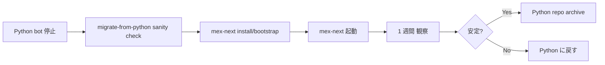

## Python MeX → mex-next 移行手順

> **対象読者**: 既存 Python MeX 顧客を Node.js 版に乗せ替える operator
> **前提**: Python MeX が稼働している account がある
> **読了時間**: 約 12 分

mex-next は Python 版の `account.json` / `state.json` を **そのまま読める** 設計です。zod schema が両方に対応しており、欠けたフィールドは default が inject されます。

## 1. 互換性の保証

| ファイル | Python 版 | mex-next |
| --- | --- | --- |
| `account.json` | pydantic v2 model dump | zod schema (互換読み) |
| `state.json` | 同上 | 同上 |
| `content/<id>/content.json` | 同上 | 同上 |
| `content/<id>/draft.json` | 同上 | 同上 |
| LLM kind 名 | snake_case | 同名 |
| Discord channel role 名 | snake_case | 同名 |

[../developer/40-storage-and-migration.md](../developer/40-storage-and-migration.md) で schema を確認できます。

## 2. 移行戦略 — 並行運用しない



**Python bot と mex-next を同じ account で同時に起動してはいけません**。両方が state.json に書こうとして race condition / flock 競合 / 重複 publish が起きます。

cut-over は **1 ステップ** で:

```text
T-1d: 顧客に「明日 9:00 に切り替えます」連絡
T-0:  systemctl stop python-mex-bot (Python VPS)
      → migrate-from-python.ts で sanity check
      → systemctl start mex-bot (Node VPS)
T+1w: 安定確認後に Python VPS を畳む
```

## 3. cut-over 計画 (推奨)

### 3.1 同 VPS の場合

Python bot が動いていた VPS をそのまま使う:

```bash
# Python bot 停止
sudo systemctl stop mex-bot.service mex-self-update.timer ...

# Node.js install (同 VPS)
curl -fsSL https://raw.githubusercontent.com/zumizumi-3/mex-next/main/scripts/install.sh | bash

# bootstrap (account 既存)
sudo /opt/mex-next/scripts/bootstrap.sh \
  --account-id zumi-x \
  --doppler-token dp.st.prd.xxx \
  --account-repo-url https://github.com/.../-x-ops \
  --skip-clone   # 既存 /srv/mex/<id>-x-ops を再利用
```

> Python 版の systemd unit と mex-next の unit は **同名** にしているので、stop/start のフロー差異は最小。

### 3.2 別 VPS の場合 (新 VPS に移す)

新 VPS 推奨 (Python の残存を完全分離):

```bash
# 1. 新 VPS で install
# 2. account repo を clone (既存 GitHub repo を流用)
git clone https://github.com/.../-x-ops /srv/mex/zumi-x-x-ops

# 3. Python bot 停止
ssh old-vps 'sudo systemctl stop mex-bot.service'

# 4. account repo の latest を pull (state.json が古いと損失)
git -C /srv/mex/zumi-x-x-ops pull

# 5. mex-next bootstrap
sudo /opt/mex-next/scripts/bootstrap.sh ...

# 6. mex-next 起動
sudo systemctl start mex-bot.service
```

state は GitHub に push されているはずなので、新 VPS で pull 直後の状態で再開できます。

## 4. migrate-from-python.ts

実体は `scripts/migrate-from-python.ts`。Python 版の account.json / state.json を読んで、

- zod schema に通るか
- 必要な default が補完されるか
- 既知の Python 固有フィールドの扱い

を確認します。

```bash
sudo -u mex node /opt/mex-next/dist/scripts/migrate-from-python.js \
  --account-repo /srv/mex/zumi-x-x-ops \
  --dry-run
```

dry-run 出力例:

```text
[migrate] reading account.json... OK (39 fields)
[migrate] reading state.json... OK (12 sections)
[migrate] schema validation:
  account.json: PASS (4 default-injected: skip_dates, last_retrospective_at, x_api_rate_limit, plan_writeback_history)
  state.json:   PASS

[migrate] python-specific fields detected:
  - account.json#legacy_voice_samples (deprecated, ignored by mex-next)
  - state.json#py_internal_cache (mex-next 側で再構築される)

[migrate] sanity check:
  posting_sessions: 5 (1 active)
  publish_queue:    1
  inbound_reaction_sessions: 3
  skip_dates: 0

[migrate] would write (no changes in dry-run):
  account.json: 4 default-injected fields
  state.json:   no changes

[migrate] OK to proceed.
```

問題なければ `--dry-run` を外して実行:

```bash
sudo -u mex node /opt/mex-next/dist/scripts/migrate-from-python.js \
  --account-repo /srv/mex/zumi-x-x-ops
```

書き戻し後に Git commit:

```bash
sudo -u mex git -C /srv/mex/zumi-x-x-ops add account.json state.json
sudo -u mex git -C /srv/mex/zumi-x-x-ops commit \
  -m "migrate: python -> mex-next schema (default-injected)"
sudo -u mex git -C /srv/mex/zumi-x-x-ops push
```

## 5. 顧客への連絡テンプレ

```text
@<顧客> いつもありがとうございます。

MeX のシステム更新で、明日 5/3 (金) 09:00 JST に
bot を Python 版から TypeScript 版に切り替えます。

切替中の 5-15 分間は bot が反応しません。
切り替え後は、Discord 上の操作は **完全に同じ** ですので、
特に何かしていただくことはありません。

万一切替後に違和感があったら、お手数ですが
「bot おかしい」と DM ください。
```

切替の所要時間:

- 同 VPS: 5-10 分
- 別 VPS: 15-30 分

## 6. cut-over 前 checklist

- [ ] Python bot を 24h 以内に通常運用していた
- [ ] account repo に最新の state がコミット済み
- [ ] Doppler に必要な secrets (Anthropic / X / Discord / GitHub) が揃っている
- [ ] mex-next の install が完了している (新 VPS の場合)
- [ ] migrate-from-python --dry-run が PASS
- [ ] 顧客に切替予告済み
- [ ] 巻き戻し手順を確認済み (3 セクション参照)

## 7. 巻き戻し (rollback)

切替直後 1 時間 / 24 時間で何かおかしいと感じたら:

```bash
# mex-next 停止
sudo systemctl stop mex-bot mex-daily-zumi-x.timer ...

# 旧 Python repo に切替
sudo systemctl start mex-bot.service  # Python の方の unit

# state.json は git pull で巻き戻すか、最新そのまま使うか判断
# → 切替直後は最新そのままで良い (zod の default 注入は副作用無)
```

複数 publish や顧客の混乱が起きた時は、`state.posting_sessions` を切替前 commit に戻す手も。ただし通常は不要です。

## 8. 移行で注意すべき差分

| 項目 | Python | mex-next | 影響 |
| --- | --- | --- | --- |
| 自然言語 intent classify | あり (簡易) | あり (拡充) | 顧客に好影響 |
| LLM provider mix | claude-code 中心 | SDK + CLI を kind ごと | 速度 ↑ コスト ↓ |
| edit-diff 学習 | あり | あり | 連続性あり |
| atomic write | flock + tmp rename | proper-lockfile + tmp rename | 同等 |
| schema migration | pydantic | zod default-inject | 同等 |

## 9. cut-over ログ保管

切替日時、所要時間、観察した違和感を operator notebook に残してください:

```text
2026-05-03 09:00 JST  zumi-x cut-over started
2026-05-03 09:08 JST  mex-bot started
2026-05-03 09:12 JST  customer first message processed (status check)
2026-05-03 19:30 JST  daily retrospective sent (OK)
2026-05-04        first publish at 12:18 (OK)
2026-05-10        1 week stable, archived python repo
```

## 10. 関連 docs

- [10-install.md](./10-install.md)
- [20-runbook.md](./20-runbook.md)
- [../developer/40-storage-and-migration.md](../developer/40-storage-and-migration.md)
